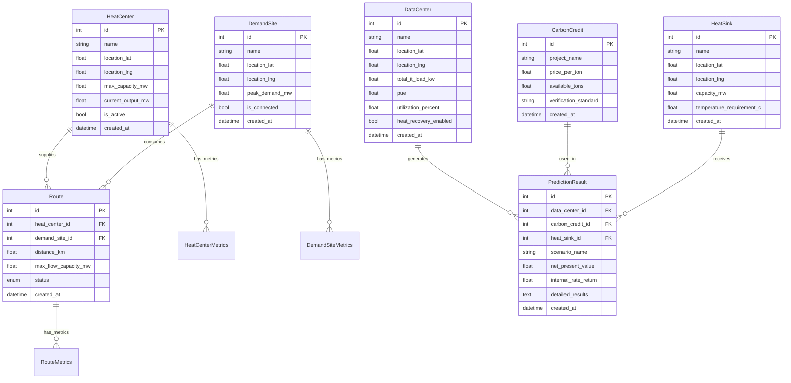

# Database Schema Documentation

## Overview

The PyRecycle Heat system uses SQLite3 as its database engine with two distinct schema groups:

1. **District Heating Schema** - Heat centers, demand sites, routes, and metrics
2. **Prediction Schema** - Data centers, carbon credits, heat sinks, and prediction results

**Database File:** `district_heating.db`  
**ORM:** SQLAlchemy (Python) → **Target:** sqlc (Go)  
**Total Tables:** 12 core tables + metrics tables

---

## Schema Diagram



---

## Table Definitions

### 1. heat_centers

**Purpose:** Stores district heating supply facilities (heat generation plants)

**Schema:**

| Column | Type | Constraints | Default | Description |
|--------|------|-------------|---------|-------------|
| id | INTEGER | PRIMARY KEY, AUTOINCREMENT | - | Unique identifier |
| name | VARCHAR(255) | NOT NULL, INDEX | - | Heat center name |
| location_lat | REAL | NOT NULL | - | Latitude (decimal degrees) |
| location_lng | REAL | NOT NULL | - | Longitude (decimal degrees) |
| address | VARCHAR(500) | NULL | - | Physical address |
| max_capacity_mw | REAL | NOT NULL | - | Maximum heat capacity (MW) |
| current_output_mw | REAL | NULL | 0.0 | Current heat output (MW) |
| efficiency_percent | REAL | NULL | 85.0 | Heat generation efficiency (%) |
| fuel_type | VARCHAR(100) | NULL | - | Primary fuel source |
| is_active | BOOLEAN | NULL | TRUE | Operational status |
| commissioning_date | DATETIME | NULL | - | Date facility went online |
| last_maintenance | DATETIME | NULL | - | Last maintenance date |
| description | TEXT | NULL | - | Additional notes |
| created_at | DATETIME | NOT NULL | CURRENT_TIMESTAMP | Record creation time |
| updated_at | DATETIME | NULL | - | Last update time |

**Indexes:**

- PRIMARY KEY on `id`
- INDEX on `name`
- Composite INDEX on `(location_lat, location_lng)` (recommended for geospatial queries)

**Relationships:**

- ONE-TO-MANY with `routes` (heat_center_id)
- ONE-TO-MANY with `heat_center_metrics` (heat_center_id)

**Source:** `models.py:16-38`

---

### 2. demand_sites

**Purpose:** Stores heat consumption facilities (buildings, districts)

**Schema:**

| Column | Type | Constraints | Default | Description |
|--------|------|-------------|---------|-------------|
| id | INTEGER | PRIMARY KEY, AUTOINCREMENT | - | Unique identifier |
| name | VARCHAR(255) | NOT NULL, INDEX | - | Demand site name |
| location_lat | REAL | NOT NULL | - | Latitude (decimal degrees) |
| location_lng | REAL | NOT NULL | - | Longitude (decimal degrees) |
| address | VARCHAR(500) | NULL | - | Physical address |
| site_type | VARCHAR(100) | NULL | - | Building/facility type |
| peak_demand_mw | REAL | NOT NULL | - | Peak heat demand (MW) |
| current_demand_mw | REAL | NULL | 0.0 | Current demand (MW) |
| annual_consumption_mwh | REAL | NULL | - | Yearly consumption (MWh) |
| is_connected | BOOLEAN | NULL | FALSE | Connected to network |
| connection_date | DATETIME | NULL | - | Date connected |
| priority_level | INTEGER | NULL | 1 | Service priority (1-5) |
| floor_area_sqm | REAL | NULL | - | Building floor area (m²) |
| building_age_years | INTEGER | NULL | - | Building age |
| insulation_rating | VARCHAR(10) | NULL | - | Insulation quality |
| description | TEXT | NULL | - | Additional notes |
| created_at | DATETIME | NOT NULL | CURRENT_TIMESTAMP | Record creation time |
| updated_at | DATETIME | NULL | - | Last update time |

**Indexes:**

- PRIMARY KEY on `id`
- INDEX on `name`
- INDEX on `site_type`
- Composite INDEX on `(location_lat, location_lng)` (recommended)

**Relationships:**

- ONE-TO-MANY with `routes` (demand_site_id)
- ONE-TO-MANY with `demand_site_metrics` (demand_site_id)

**Source:** `models.py:40-66`

---

### 3. routes

**Purpose:** Stores distribution network connections between heat centers and demand sites

**Schema:**

| Column | Type | Constraints | Default | Description |
|--------|------|-------------|---------|-------------|
| id | INTEGER | PRIMARY KEY, AUTOINCREMENT | - | Unique identifier |
| heat_center_id | INTEGER | NOT NULL, FK, INDEX | - | Source heat center |
| demand_site_id | INTEGER | NOT NULL, FK, INDEX | - | Destination demand site |
| distance_km | REAL | NOT NULL | - | Pipeline distance (km) |
| pipe_diameter_mm | INTEGER | NULL | - | Pipe diameter (mm) |
| max_flow_capacity_mw | REAL | NOT NULL | - | Maximum heat flow (MW) |
| current_flow_mw | REAL | NULL | 0.0 | Current flow (MW) |
| supply_temp_celsius | REAL | NULL | 80.0 | Supply temperature (°C) |
| return_temp_celsius | REAL | NULL | 40.0 | Return temperature (°C) |
| pressure_bar | REAL | NULL | 16.0 | Operating pressure (bar) |
| heat_loss_percent | REAL | NULL | 2.0 | Heat loss percentage |
| installation_year | INTEGER | NULL | - | Year installed |
| pipe_material | VARCHAR(100) | NULL | - | Pipe material type |
| insulation_type | VARCHAR(100) | NULL | - | Insulation type |
| status | VARCHAR(20) | NULL | 'ACTIVE' | Route status (ENUM) |
| is_bidirectional | BOOLEAN | NULL | FALSE | Bidirectional flow |
| maintenance_due | DATETIME | NULL | - | Next maintenance date |
| construction_cost | REAL | NULL | - | Initial construction cost |
| annual_maintenance_cost | REAL | NULL | - | Annual maintenance cost |
| created_at | DATETIME | NOT NULL | CURRENT_TIMESTAMP | Record creation time |
| updated_at | DATETIME | NULL | - | Last update time |

**Indexes:**

- PRIMARY KEY on `id`
- INDEX on `heat_center_id`
- INDEX on `demand_site_id`
- Composite INDEX on `(heat_center_id, demand_site_id)` for lookups

**Foreign Keys:**

- `heat_center_id` → `heat_centers(id)`
- `demand_site_id` → `demand_sites(id)`

**Enums:**

- `status`: ['ACTIVE', 'INACTIVE', 'MAINTENANCE', 'PLANNED']

**Constraints:**

- UNIQUE constraint on `(heat_center_id, demand_site_id)` to prevent duplicate routes

**Relationships:**

- MANY-TO-ONE with `heat_centers`
- MANY-TO-ONE with `demand_sites`
- ONE-TO-MANY with `route_metrics`

**Source:** `models.py:68-100`

---

### 4. system_config

**Purpose:** Stores system-wide configuration key-value pairs

**Schema:**

| Column | Type | Constraints | Default | Description |
|--------|------|-------------|---------|-------------|
| id | INTEGER | PRIMARY KEY, AUTOINCREMENT | - | Unique identifier |
| config_key | VARCHAR(100) | NOT NULL, UNIQUE, INDEX | - | Configuration key |
| config_value | TEXT | NOT NULL | - | Configuration value |
| config_type | VARCHAR(50) | NULL | 'string' | Value type (string/int/float/bool/json) |
| description | TEXT | NULL | - | Configuration description |
| is_active | BOOLEAN | NULL | TRUE | Whether config is active |
| created_at | DATETIME | NOT NULL | CURRENT_TIMESTAMP | Record creation time |
| updated_at | DATETIME | NULL | - | Last update time |

**Indexes:**

- PRIMARY KEY on `id`
- UNIQUE INDEX on `config_key`

**Source:** `models.py:102-113`

---

### 5. heat_center_metrics

**Purpose:** Time-series operational metrics for heat centers

**Schema:**

| Column | Type | Constraints | Default | Description |
|--------|------|-------------|---------|-------------|
| id | INTEGER | PRIMARY KEY, AUTOINCREMENT | - | Unique identifier |
| heat_center_id | INTEGER | NOT NULL, FK, INDEX | - | Associated heat center |
| timestamp | DATETIME | NOT NULL, INDEX | - | Measurement timestamp |
| output_mw | REAL | NOT NULL | - | Heat output (MW) |
| efficiency_percent | REAL | NULL | - | Operating efficiency (%) |
| fuel_consumption | REAL | NULL | - | Fuel consumption rate |
| operational_cost_hour | REAL | NULL | - | Operating cost ($/hour) |
| co2_emissions_kg_hour | REAL | NULL | - | CO₂ emissions (kg/hour) |
| created_at | DATETIME | NOT NULL | CURRENT_TIMESTAMP | Record creation time |

**Indexes:**

- PRIMARY KEY on `id`
- INDEX on `heat_center_id`
- INDEX on `timestamp`
- Composite INDEX on `(heat_center_id, timestamp)` for time-series queries

**Foreign Keys:**

- `heat_center_id` → `heat_centers(id)`

**Source:** `models.py:115-129`

---

### 6. demand_site_metrics

**Purpose:** Time-series consumption metrics for demand sites

**Schema:**

| Column | Type | Constraints | Default | Description |
|--------|------|-------------|---------|-------------|
| id | INTEGER | PRIMARY KEY, AUTOINCREMENT | - | Unique identifier |
| demand_site_id | INTEGER | NOT NULL, FK, INDEX | - | Associated demand site |
| timestamp | DATETIME | NOT NULL, INDEX | - | Measurement timestamp |
| demand_mw | REAL | NOT NULL | - | Heat demand (MW) |
| supply_temp_celsius | REAL | NULL | - | Supply temperature (°C) |
| return_temp_celsius | REAL | NULL | - | Return temperature (°C) |
| flow_rate_m3_hour | REAL | NULL | - | Flow rate (m³/hour) |
| created_at | DATETIME | NOT NULL | CURRENT_TIMESTAMP | Record creation time |

**Indexes:**

- PRIMARY KEY on `id`
- INDEX on `demand_site_id`
- INDEX on `timestamp`
- Composite INDEX on `(demand_site_id, timestamp)`

**Foreign Keys:**

- `demand_site_id` → `demand_sites(id)`

**Source:** `models.py:131-143`

---

### 7. route_metrics

**Purpose:** Time-series flow metrics for distribution routes

**Schema:**

| Column | Type | Constraints | Default | Description |
|--------|------|-------------|---------|-------------|
| id | INTEGER | PRIMARY KEY, AUTOINCREMENT | - | Unique identifier |
| route_id | INTEGER | NOT NULL, FK, INDEX | - | Associated route |
| timestamp | DATETIME | NOT NULL, INDEX | - | Measurement timestamp |
| flow_mw | REAL | NOT NULL | - | Heat flow (MW) |
| supply_temp_celsius | REAL | NULL | - | Supply temperature (°C) |
| return_temp_celsius | REAL | NULL | - | Return temperature (°C) |
| pressure_bar | REAL | NULL | - | Operating pressure (bar) |
| heat_loss_mw | REAL | NULL | - | Heat loss (MW) |
| created_at | DATETIME | NOT NULL | CURRENT_TIMESTAMP | Record creation time |

**Indexes:**

- PRIMARY KEY on `id`
- INDEX on `route_id`
- INDEX on `timestamp`
- Composite INDEX on `(route_id, timestamp)`

**Foreign Keys:**

- `route_id` → `routes(id)`

**Source:** `models.py:145-157`

---

### 8. data_centers

**Purpose:** Stores data center facilities for heat recovery analysis

**Schema:**

| Column | Type | Constraints | Default | Description |
|--------|------|-------------|---------|-------------|
| id | INTEGER | PRIMARY KEY, AUTOINCREMENT | - | Unique identifier |
| name | VARCHAR | NOT NULL | - | Data center name |
| location_lat | REAL | NOT NULL | - | Latitude (decimal degrees) |
| location_lng | REAL | NOT NULL | - | Longitude (decimal degrees) |
| address | VARCHAR | NULL | - | Physical address |
| dc_type | VARCHAR | NULL | 'colocation' | Data center type |
| total_it_load_kw | REAL | NOT NULL | - | IT equipment capacity (kW) |
| pue | REAL | NULL | 1.5 | Power Usage Effectiveness |
| utilization_percent | REAL | NULL | 70.0 | Average utilization (%) |
| cooling_type | VARCHAR | NULL | 'air' | Cooling system type |
| energy_source | VARCHAR | NULL | 'grid' | Primary energy source |
| renewable_percent | REAL | NULL | 0.0 | Renewable energy (%) |
| electricity_cost_kwh | REAL | NULL | 0.15 | Electricity rate ($/kWh) |
| operating_hours_year | INTEGER | NULL | 8760 | Annual operating hours |
| heat_recovery_enabled | BOOLEAN | NULL | FALSE | Heat recovery status |
| created_at | DATETIME | NOT NULL | CURRENT_TIMESTAMP | Record creation time |

**Indexes:**

- PRIMARY KEY on `id`
- Composite INDEX on `(location_lat, location_lng)` (recommended)

**Relationships:**

- ONE-TO-MANY with `prediction_results` (data_center_id)

**Source:** `prediction_models.py:10-30`

---

### 9. carbon_credits

**Purpose:** Stores carbon credit projects and pricing

**Schema:**

| Column | Type | Constraints | Default | Description |
|--------|------|-------------|---------|-------------|
| id | INTEGER | PRIMARY KEY, AUTOINCREMENT | - | Unique identifier |
| project_name | VARCHAR | NOT NULL | - | Carbon project name |
| credit_type | VARCHAR | NULL | 'renewable_energy' | Type of carbon credit |
| price_per_ton | REAL | NOT NULL | - | Price per ton CO₂ ($) |
| available_tons | REAL | NOT NULL | - | Available credits (tons) |
| vintage_year | INTEGER | NULL | - | Credit vintage year |
| verification_standard | VARCHAR | NULL | 'VCS' | Verification standard |
| location | VARCHAR | NULL | - | Project location |
| project_description | TEXT | NULL | - | Project description |
| created_at | DATETIME | NOT NULL | CURRENT_TIMESTAMP | Record creation time |

**Indexes:**

- PRIMARY KEY on `id`

**Relationships:**

- ONE-TO-MANY with `prediction_results` (carbon_credit_id)

**Source:** `prediction_models.py:32-46`

---

### 10. heat_sinks

**Purpose:** Stores heat sink facilities (heat consumers for data center waste heat)

**Schema:**

| Column | Type | Constraints | Default | Description |
|--------|------|-------------|---------|-------------|
| id | INTEGER | PRIMARY KEY, AUTOINCREMENT | - | Unique identifier |
| name | VARCHAR | NOT NULL | - | Heat sink name |
| location_lat | REAL | NOT NULL | - | Latitude (decimal degrees) |
| location_lng | REAL | NOT NULL | - | Longitude (decimal degrees) |
| address | VARCHAR | NULL | - | Physical address |
| sink_type | VARCHAR | NULL | 'district_heating' | Type of heat sink |
| capacity_mw | REAL | NOT NULL | - | Heat capacity (MW) |
| current_demand_mw | REAL | NULL | 0.0 | Current demand (MW) |
| temperature_requirement_c | REAL | NULL | 60.0 | Required temperature (°C) |
| seasonal_factor | REAL | NULL | 1.0 | Seasonal demand factor |
| connection_cost_per_km | REAL | NULL | 100000.0 | Connection cost ($/km) |
| heat_price_per_mwh | REAL | NULL | 50.0 | Heat price ($/MWh) |
| operating_hours_year | INTEGER | NULL | 8760 | Annual operating hours |
| created_at | DATETIME | NOT NULL | CURRENT_TIMESTAMP | Record creation time |

**Indexes:**

- PRIMARY KEY on `id`
- Composite INDEX on `(location_lat, location_lng)` (recommended)

**Relationships:**

- ONE-TO-MANY with `prediction_results` (heat_sink_id)

**Source:** `prediction_models.py:48-66`

---

### 11. prediction_results

**Purpose:** Stores saved prediction analysis results

**Schema:**

| Column | Type | Constraints | Default | Description |
|--------|------|-------------|---------|-------------|
| id | INTEGER | PRIMARY KEY, AUTOINCREMENT | - | Unique identifier |
| data_center_id | INTEGER | NOT NULL, FK | - | Associated data center |
| carbon_credit_id | INTEGER | NULL, FK | - | Associated carbon credit |
| heat_sink_id | INTEGER | NULL, FK | - | Associated heat sink |
| scenario_name | VARCHAR | NULL | 'base_case' | Scenario identifier |
| analysis_years | INTEGER | NULL | 10 | Analysis time horizon |
| total_capex | REAL | NULL | - | Total CAPEX ($) |
| annual_opex | REAL | NULL | - | Annual OPEX ($) |
| annual_savings | REAL | NULL | - | Annual savings ($) |
| net_present_value | REAL | NULL | - | NPV ($) |
| internal_rate_return | REAL | NULL | - | IRR (decimal) |
| payback_period_years | REAL | NULL | - | Payback period (years) |
| investment_grade | VARCHAR | NULL | - | Investment grade (A-D) |
| annual_co2_reduction_kg | REAL | NULL | - | CO₂ reduction (kg/year) |
| annual_heat_recovery_kwh | REAL | NULL | - | Heat recovery (kWh/year) |
| detailed_results | TEXT | NULL | - | Full results JSON |
| created_at | DATETIME | NOT NULL | CURRENT_TIMESTAMP | Record creation time |

**Indexes:**

- PRIMARY KEY on `id`
- INDEX on `data_center_id`
- INDEX on `carbon_credit_id`
- INDEX on `heat_sink_id`

**Foreign Keys:**

- `data_center_id` → `data_centers(id)`
- `carbon_credit_id` → `carbon_credits(id)` (NULLABLE)
- `heat_sink_id` → `heat_sinks(id)` (NULLABLE)

**Source:** `prediction_models.py:68-95`

---

### 12. prediction_scenarios

**Purpose:** Stores reusable prediction scenario templates

**Schema:**

| Column | Type | Constraints | Default | Description |
|--------|------|-------------|---------|-------------|
| id | INTEGER | PRIMARY KEY, AUTOINCREMENT | - | Unique identifier |
| name | VARCHAR | NOT NULL | - | Scenario name |
| description | TEXT | NULL | - | Scenario description |
| base_parameters | TEXT | NULL | - | Parameters JSON |
| created_at | DATETIME | NOT NULL | CURRENT_TIMESTAMP | Record creation time |

**Indexes:**

- PRIMARY KEY on `id`

**Source:** `prediction_models.py:97-104`

---

## Data Type Mapping (Python → Go)

For sqlc implementation, use these type mappings:

| Python/SQLAlchemy | SQLite | Go (sqlc) | Notes |
|-------------------|--------|-----------|-------|
| Integer | INTEGER | int64 | Primary keys, counts |
| String | TEXT/VARCHAR | string | Text fields |
| Float | REAL | float64 | Decimal numbers |
| Boolean | INTEGER | bool | 0=false, 1=true |
| DateTime | TEXT | time.Time | ISO 8601 format |
| Text | TEXT | string | Long text |
| Enum | TEXT | string | Store as string, validate in code |

---

## Constraints Summary

### Foreign Key Constraints

```sql
routes.heat_center_id → heat_centers.id
routes.demand_site_id → demand_sites.id
heat_center_metrics.heat_center_id → heat_centers.id
demand_site_metrics.demand_site_id → demand_sites.id
route_metrics.route_id → routes.id
prediction_results.data_center_id → data_centers.id
prediction_results.carbon_credit_id → carbon_credits.id
prediction_results.heat_sink_id → heat_sinks.id
```

### Unique Constraints

```sql
UNIQUE (heat_center_id, demand_site_id) ON routes
UNIQUE (config_key) ON system_config
```

### Check Constraints (Recommended)

```sql
CHECK (location_lat BETWEEN -90 AND 90)
CHECK (location_lng BETWEEN -180 AND 180)
CHECK (pue >= 1.0 AND pue <= 3.0)
CHECK (utilization_percent >= 0 AND utilization_percent <= 100)
CHECK (efficiency_percent >= 0 AND efficiency_percent <= 100)
CHECK (renewable_percent >= 0 AND renewable_percent <= 100)
CHECK (operating_hours_year >= 1 AND operating_hours_year <= 8760)
```

---

## Migration Strategy for Go

### Phase 1: Schema Migration

1. **Create migration files** using a migration tool (github.com/pressly/goose)
2. **Generate sqlc code** from schema definitions
3. **Implement validation** in application layer for constraints

### Phase 2: Data Migration

1. Export existing SQLite data
2. Transform data types as needed
3. Import into new schema
4. Verify referential integrity

### Sample sqlc Configuration

```yaml
version: "2"
sql:
  - engine: "sqlite"
    queries: "internal/database/queries/"
    schema: "internal/database/schema/"
    gen:
      go:
        package: "database"
        out: "internal/database"
        emit_json_tags: true
        emit_prepared_queries: true
        emit_interface: true
        emit_exact_table_names: false
        emit_empty_slices: true
```

---

## Indexes Optimization

### Recommended Composite Indexes

```sql
CREATE INDEX idx_heat_centers_location ON heat_centers(location_lat, location_lng);
CREATE INDEX idx_demand_sites_location ON demand_sites(location_lat, location_lng);
CREATE INDEX idx_heat_centers_active ON heat_centers(is_active, id);
CREATE INDEX idx_demand_sites_connected ON demand_sites(is_connected, id);
CREATE INDEX idx_routes_lookup ON routes(heat_center_id, demand_site_id);
CREATE INDEX idx_metrics_timeseries ON heat_center_metrics(heat_center_id, timestamp DESC);
```

---

## Notes for Go Implementation

1. **Use sqlc for type-safe queries** - Generates Go code from SQL
2. **Implement soft deletes** if needed - Add `deleted_at` column
3. **Use database/sql with sqlite3 driver** - `github.com/mattn/go-sqlite3`
4. **Enable foreign keys** - `PRAGMA foreign_keys = ON;`
5. **Use transactions** for multi-table operations
6. **Implement connection pooling** - Configure `sql.DB` properly
7. **Add database constraints** in schema, not just application
8. **Use prepared statements** - sqlc generates these automatically

---

## References

- **Python Models:** `backend/models.py`, `backend/prediction_models.py`
- **Database:** SQLite3 (single-file, embedded)
- **Target Tools:** sqlc, goose
- **Go Drivers:** github.com/mattn/go-sqlite3
