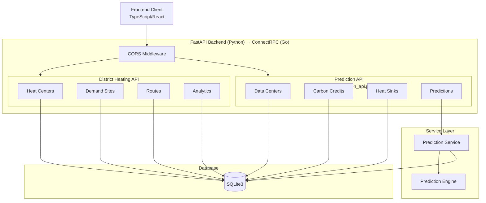

# API Endpoints Documentation

## Overview

The PyRecycle Heat backend exposes two API groups:

1. **District Heating API** - CRUD operations for heat centers, demand sites, and routes
2. **Prediction API** - Data center prediction and analysis operations

**Framework:** FastAPI (Python) → **Target:** ConnectRPC (Go)  
**API Prefix:** `/api/v1/`  
**Base URL:** `http://localhost:8000` (development)

---

## API Architecture Diagram



---

## District Heating API

**Base Path:** `/api/v1/`  
**Source:** `backend/app.py`

### 1. Heat Centers Endpoints

#### GET /api/v1/heat-centers

**Purpose:** Retrieve all heat centers

**Request:**

```http
GET /api/v1/heat-centers HTTP/1.1
```

**Response:** `200 OK`

```json
[
  {
    "id": 1,
    "name": "string",
    "location_lat": 37.7749,
    "location_lng": -122.4194,
    "address": "string",
    "max_capacity_mw": 100.0,
    "current_output_mw": 75.0,
    "efficiency_percent": 85.0,
    "fuel_type": "natural_gas",
    "is_active": true,
    "commissioning_date": "2024-01-01T00:00:00Z",
    "last_maintenance": "2024-10-01T00:00:00Z",
    "description": "string",
    "created_at": "2024-01-01T00:00:00Z",
    "updated_at": "2024-10-15T00:00:00Z"
  }
]
```

**Source:** `app.py:70-72`

---

#### POST /api/v1/heat-centers

**Purpose:** Create a new heat center

**Request:**

```http
POST /api/v1/heat-centers HTTP/1.1
Content-Type: application/json

{
  "name": "string",
  "location_lat": 37.7749,
  "location_lng": -122.4194,
  "address": "string",
  "max_capacity_mw": 100.0,
  "current_output_mw": 75.0,
  "efficiency_percent": 85.0,
  "fuel_type": "natural_gas",
  "is_active": true,
  "commissioning_date": "2024-01-01T00:00:00Z",
  "last_maintenance": "2024-10-01T00:00:00Z",
  "description": "string"
}
```

**Response:** `200 OK`

```json
{
  "id": 1,
  "name": "string",
  "location_lat": 37.7749,
  "location_lng": -122.4194,
  // ... (full heat center object)
  "created_at": "2024-01-01T00:00:00Z"
}
```

**Source:** `app.py:74-79`

---

#### PUT /api/v1/heat-centers/{id}

**Purpose:** Update an existing heat center

**Request:**

```http
PUT /api/v1/heat-centers/1 HTTP/1.1
Content-Type: application/json

{
  "name": "string",
  "location_lat": 37.7749,
  "location_lng": -122.4194,
  // ... (partial or full heat center object)
}
```

**Response:** `200 OK`

```json
{
  "id": 1,
  "name": "string",
  // ... (updated heat center object)
  "updated_at": "2024-10-22T00:00:00Z"
}
```

**Error Responses:**

- `404 Not Found` - Heat center not found

**Source:** `app.py:81-93`

---

#### DELETE /api/v1/heat-centers/{id}

**Purpose:** Delete a heat center

**Request:**

```http
DELETE /api/v1/heat-centers/1 HTTP/1.1
```

**Response:** `200 OK`

```json
{
  "message": "Heat center deleted successfully"
}
```

**Error Responses:**

- `404 Not Found` - Heat center not found

**Source:** `app.py:95-102`

---

### 2. Demand Sites Endpoints

#### GET /api/v1/demand-sites

**Purpose:** Retrieve all demand sites

**Request:**

```http
GET /api/v1/demand-sites HTTP/1.1
```

**Response:** `200 OK`

```json
[
  {
    "id": 1,
    "name": "string",
    "location_lat": 37.7749,
    "location_lng": -122.4194,
    "address": "string",
    "site_type": "residential",
    "peak_demand_mw": 50.0,
    "current_demand_mw": 35.0,
    "annual_consumption_mwh": 300000.0,
    "is_connected": true,
    "connection_date": "2024-01-01T00:00:00Z",
    "priority_level": 1,
    "floor_area_sqm": 10000.0,
    "building_age_years": 10,
    "insulation_rating": "A",
    "description": "string",
    "created_at": "2024-01-01T00:00:00Z",
    "updated_at": "2024-10-15T00:00:00Z"
  }
]
```

**Source:** `app.py:104-106`

---

#### POST /api/v1/demand-sites

**Purpose:** Create a new demand site

**Request:**

```http
POST /api/v1/demand-sites HTTP/1.1
Content-Type: application/json

{
  "name": "string",
  "location_lat": 37.7749,
  "location_lng": -122.4194,
  "address": "string",
  "site_type": "residential",
  "peak_demand_mw": 50.0,
  "current_demand_mw": 35.0,
  // ... (demand site fields)
}
```

**Response:** `200 OK` (created demand site object)

**Source:** `app.py:108-113`

---

#### PUT /api/v1/demand-sites/{id}

**Purpose:** Update an existing demand site

**Request:**

```http
PUT /api/v1/demand-sites/1 HTTP/1.1
Content-Type: application/json

{
  "current_demand_mw": 40.0,
  "is_connected": true
  // ... (partial or full demand site object)
}
```

**Response:** `200 OK` (updated demand site object)

**Error Responses:**

- `404 Not Found` - Demand site not found

**Source:** `app.py:115-127`

---

#### DELETE /api/v1/demand-sites/{id}

**Purpose:** Delete a demand site

**Request:**

```http
DELETE /api/v1/demand-sites/1 HTTP/1.1
```

**Response:** `200 OK`

```json
{
  "message": "Demand site deleted successfully"
}
```

**Error Responses:**

- `404 Not Found` - Demand site not found

**Source:** `app.py:129-136`

---

### 3. Routes Endpoints

#### GET /api/v1/routes

**Purpose:** Retrieve all distribution routes

**Request:**

```http
GET /api/v1/routes HTTP/1.1
```

**Response:** `200 OK`

```json
[
  {
    "id": 1,
    "heat_center_id": 1,
    "demand_site_id": 1,
    "distance_km": 5.2,
    "pipe_diameter_mm": 500,
    "max_flow_capacity_mw": 50.0,
    "current_flow_mw": 35.0,
    "supply_temp_celsius": 80.0,
    "return_temp_celsius": 40.0,
    "pressure_bar": 16.0,
    "heat_loss_percent": 2.0,
    "installation_year": 2020,
    "pipe_material": "steel",
    "insulation_type": "polyurethane",
    "status": "ACTIVE",
    "is_bidirectional": false,
    "maintenance_due": "2025-01-01T00:00:00Z",
    "construction_cost": 500000.0,
    "annual_maintenance_cost": 25000.0,
    "created_at": "2024-01-01T00:00:00Z",
    "updated_at": "2024-10-15T00:00:00Z"
  }
]
```

**Source:** `app.py:138-140`

---

#### POST /api/v1/routes

**Purpose:** Create a new route

**Request:**

```http
POST /api/v1/routes HTTP/1.1
Content-Type: application/json

{
  "heat_center_id": 1,
  "demand_site_id": 1,
  "distance_km": 5.2,
  "pipe_diameter_mm": 500,
  "max_flow_capacity_mw": 50.0,
  "status": "ACTIVE"
  // ... (route fields)
}
```

**Response:** `200 OK` (created route object)

**Source:** `app.py:142-147`

---

#### PUT /api/v1/routes/{id}

**Purpose:** Update an existing route

**Request:**

```http
PUT /api/v1/routes/1 HTTP/1.1
Content-Type: application/json

{
  "current_flow_mw": 40.0,
  "status": "MAINTENANCE"
  // ... (partial or full route object)
}
```

**Response:** `200 OK` (updated route object)

**Error Responses:**

- `404 Not Found` - Route not found

**Source:** `app.py:149-161`

---

#### DELETE /api/v1/routes/{id}

**Purpose:** Delete a route

**Request:**

```http
DELETE /api/v1/routes/1 HTTP/1.1
```

**Response:** `200 OK`

```json
{
  "message": "Route deleted successfully"
}
```

**Error Responses:**

- `404 Not Found` - Route not found

**Source:** `app.py:163-170`

---

### 4. Analytics Endpoints

#### GET /api/v1/analytics/summary

**Purpose:** Retrieve system-wide analytics summary

**Request:**

```http
GET /api/v1/analytics/summary HTTP/1.1
```

**Response:** `200 OK`

```json
{
  "total_heat_centers": 10,
  "total_demand_sites": 50,
  "total_routes": 75,
  "active_heat_centers": 8,
  "connected_demand_sites": 45,
  "total_capacity_mw": 500.0,
  "total_current_output_mw": 375.0,
  "total_demand_mw": 350.0,
  "system_efficiency_percent": 82.5,
  "total_active_routes": 70
}
```

**Logic:**

- Aggregates counts from database tables
- Calculates sums of capacity and output
- Computes system-wide efficiency

**Source:** `app.py:172-193`

---

## Prediction API

**Base Path:** `/api/v1/prediction/`  
**Source:** `backend/prediction_api.py`  
**Router Prefix:** `prediction` (mounted in `app.py:62`)

### 1. Data Centers Endpoints

#### GET /api/v1/prediction/data-centers

**Purpose:** Retrieve all data centers

**Request:**

```http
GET /api/v1/prediction/data-centers HTTP/1.1
```

**Response:** `200 OK`

```json
[
  {
    "id": 1,
    "name": "string",
    "location_lat": 37.7749,
    "location_lng": -122.4194,
    "address": "string",
    "dc_type": "colocation",
    "total_it_load_kw": 5000.0,
    "pue": 1.5,
    "utilization_percent": 70.0,
    "cooling_type": "air",
    "energy_source": "grid",
    "renewable_percent": 30.0,
    "electricity_cost_kwh": 0.15,
    "operating_hours_year": 8760,
    "heat_recovery_enabled": false,
    "created_at": "2024-01-01T00:00:00Z"
  }
]
```

**Source:** `prediction_api.py:61-63`

---

#### GET /api/v1/prediction/data-centers/{id}

**Purpose:** Retrieve a specific data center

**Request:**

```http
GET /api/v1/prediction/data-centers/1 HTTP/1.1
```

**Response:** `200 OK` (data center object)

**Error Responses:**

- `404 Not Found` - Data center not found

**Source:** `prediction_api.py:65-70`

---

#### POST /api/v1/prediction/data-centers

**Purpose:** Create a new data center

**Request:**

```http
POST /api/v1/prediction/data-centers HTTP/1.1
Content-Type: application/json

{
  "name": "string",
  "location_lat": 37.7749,
  "location_lng": -122.4194,
  "address": "string",
  "total_it_load_kw": 5000.0,
  "pue": 1.5,
  "utilization_percent": 70.0
  // ... (data center fields)
}
```

**Response:** `201 Created`

```json
{
  "id": 1,
  "name": "string",
  // ... (created data center object)
  "created_at": "2024-01-01T00:00:00Z"
}
```

**Source:** `prediction_api.py:72-82`

---

#### PUT /api/v1/prediction/data-centers/{id}

**Purpose:** Update an existing data center

**Request:**

```http
PUT /api/v1/prediction/data-centers/1 HTTP/1.1
Content-Type: application/json

{
  "utilization_percent": 80.0,
  "heat_recovery_enabled": true
  // ... (partial or full data center object)
}
```

**Response:** `200 OK` (updated data center object)

**Error Responses:**

- `404 Not Found` - Data center not found

**Source:** `prediction_api.py:84-100`

---

#### DELETE /api/v1/prediction/data-centers/{id}

**Purpose:** Delete a data center

**Request:**

```http
DELETE /api/v1/prediction/data-centers/1 HTTP/1.1
```

**Response:** `200 OK`

```json
{
  "message": "Data center deleted successfully"
}
```

**Error Responses:**

- `404 Not Found` - Data center not found

**Source:** `prediction_api.py:102-109`

---

### 2. Carbon Credits Endpoints

#### GET /api/v1/prediction/carbon-credits

**Purpose:** Retrieve all carbon credits

**Request:**

```http
GET /api/v1/prediction/carbon-credits HTTP/1.1
```

**Response:** `200 OK`

```json
[
  {
    "id": 1,
    "project_name": "string",
    "credit_type": "renewable_energy",
    "price_per_ton": 25.0,
    "available_tons": 10000.0,
    "vintage_year": 2024,
    "verification_standard": "VCS",
    "location": "string",
    "project_description": "string",
    "created_at": "2024-01-01T00:00:00Z"
  }
]
```

**Source:** `prediction_api.py:111-113`

---

#### GET /api/v1/prediction/carbon-credits/{id}

**Purpose:** Retrieve a specific carbon credit

**Request:**

```http
GET /api/v1/prediction/carbon-credits/1 HTTP/1.1
```

**Response:** `200 OK` (carbon credit object)

**Error Responses:**

- `404 Not Found` - Carbon credit not found

**Source:** `prediction_api.py:115-120`

---

#### POST /api/v1/prediction/carbon-credits

**Purpose:** Create a new carbon credit

**Request:**

```http
POST /api/v1/prediction/carbon-credits HTTP/1.1
Content-Type: application/json

{
  "project_name": "string",
  "credit_type": "renewable_energy",
  "price_per_ton": 25.0,
  "available_tons": 10000.0,
  "vintage_year": 2024,
  "verification_standard": "VCS"
  // ... (carbon credit fields)
}
```

**Response:** `201 Created` (created carbon credit object)

**Source:** `prediction_api.py:122-132`

---

#### PUT /api/v1/prediction/carbon-credits/{id}

**Purpose:** Update an existing carbon credit

**Request:**

```http
PUT /api/v1/prediction/carbon-credits/1 HTTP/1.1
Content-Type: application/json

{
  "price_per_ton": 30.0,
  "available_tons": 8000.0
  // ... (partial or full carbon credit object)
}
```

**Response:** `200 OK` (updated carbon credit object)

**Error Responses:**

- `404 Not Found` - Carbon credit not found

**Source:** `prediction_api.py:134-150`

---

#### DELETE /api/v1/prediction/carbon-credits/{id}

**Purpose:** Delete a carbon credit

**Request:**

```http
DELETE /api/v1/prediction/carbon-credits/1 HTTP/1.1
```

**Response:** `200 OK`

```json
{
  "message": "Carbon credit deleted successfully"
}
```

**Error Responses:**

- `404 Not Found` - Carbon credit not found

**Source:** `prediction_api.py:152-159`

---

### 3. Heat Sinks Endpoints

#### GET /api/v1/prediction/heat-sinks

**Purpose:** Retrieve all heat sinks

**Request:**

```http
GET /api/v1/prediction/heat-sinks HTTP/1.1
```

**Response:** `200 OK`

```json
[
  {
    "id": 1,
    "name": "string",
    "location_lat": 37.7749,
    "location_lng": -122.4194,
    "address": "string",
    "sink_type": "district_heating",
    "capacity_mw": 10.0,
    "current_demand_mw": 7.0,
    "temperature_requirement_c": 60.0,
    "seasonal_factor": 1.0,
    "connection_cost_per_km": 100000.0,
    "heat_price_per_mwh": 50.0,
    "operating_hours_year": 8760,
    "created_at": "2024-01-01T00:00:00Z"
  }
]
```

**Source:** `prediction_api.py:161-163`

---

#### GET /api/v1/prediction/heat-sinks/{id}

**Purpose:** Retrieve a specific heat sink

**Request:**

```http
GET /api/v1/prediction/heat-sinks/1 HTTP/1.1
```

**Response:** `200 OK` (heat sink object)

**Error Responses:**

- `404 Not Found` - Heat sink not found

**Source:** `prediction_api.py:165-170`

---

#### POST /api/v1/prediction/heat-sinks

**Purpose:** Create a new heat sink

**Request:**

```http
POST /api/v1/prediction/heat-sinks HTTP/1.1
Content-Type: application/json

{
  "name": "string",
  "location_lat": 37.7749,
  "location_lng": -122.4194,
  "sink_type": "district_heating",
  "capacity_mw": 10.0,
  "temperature_requirement_c": 60.0
  // ... (heat sink fields)
}
```

**Response:** `201 Created` (created heat sink object)

**Source:** `prediction_api.py:172-182`

---

#### PUT /api/v1/prediction/heat-sinks/{id}

**Purpose:** Update an existing heat sink

**Request:**

```http
PUT /api/v1/prediction/heat-sinks/1 HTTP/1.1
Content-Type: application/json

{
  "current_demand_mw": 8.0,
  "heat_price_per_mwh": 55.0
  // ... (partial or full heat sink object)
}
```

**Response:** `200 OK` (updated heat sink object)

**Error Responses:**

- `404 Not Found` - Heat sink not found

**Source:** `prediction_api.py:184-200`

---

#### DELETE /api/v1/prediction/heat-sinks/{id}

**Purpose:** Delete a heat sink

**Request:**

```http
DELETE /api/v1/prediction/heat-sinks/1 HTTP/1.1
```

**Response:** `200 OK`

```json
{
  "message": "Heat sink deleted successfully"
}
```

**Error Responses:**

- `404 Not Found` - Heat sink not found

**Source:** `prediction_api.py:202-209`

---

### 4. Prediction Calculation Endpoint

#### POST /api/v1/prediction/calculate

**Purpose:** Calculate comprehensive savings prediction for a data center

**Request:**

```http
POST /api/v1/prediction/calculate HTTP/1.1
Content-Type: application/json

{
  "data_center_id": 1,
  "carbon_credit_id": 1,
  "heat_sink_ids": [1, 2],
  "scenario_name": "Optimistic Case",
  "analysis_years": 15,
  "discount_rate": 0.08,
  "custom_pue": 1.3,
  "custom_efficiency": 0.9,
  "custom_electricity_rate": 0.18,
  "custom_carbon_price": 30.0
}
```

**Request Body Fields:**

| Field | Type | Required | Default | Description |
|-------|------|----------|---------|-------------|
| data_center_id | int | Yes | - | Data center to analyze |
| carbon_credit_id | int | No | null | Carbon credit project |
| heat_sink_ids | int[] | No | [] | Heat sink facilities |
| scenario_name | string | No | "Base Case" | Scenario identifier |
| analysis_years | int | No | 10 | Analysis period (1-30) |
| discount_rate | float | No | 0.08 | NPV discount rate (0-0.3) |
| custom_pue | float | No | null | Override PUE value |
| custom_efficiency | float | No | null | Override heat recovery efficiency |
| custom_electricity_rate | float | No | null | Override electricity rate |
| custom_carbon_price | float | No | null | Override carbon price |

**Response:** `200 OK`

```json
{
  "prediction_id": 1,
  "data_center_id": 1,
  "scenario_name": "Optimistic Case",
  "analysis_years": 15,
  "discount_rate": 0.08,
  
  "energy_metrics": {
    "effective_it_load_kw": 3500.0,
    "total_power_kw": 5250.0,
    "annual_energy_kwh": 46026000.0,
    "annual_energy_cost": 6903900.0,
    "waste_heat_kw": 3325.0
  },
  
  "heat_recovery_metrics": {
    "waste_heat_available_kw": 3325.0,
    "recoverable_heat_kw": 2743.65,
    "annual_heat_recovery_kwh": 24026616.0,
    "equivalent_gas_therms": 819307.61,
    "annual_gas_cost_savings": 983169.13,
    "co2_avoided_kg_per_year": 4342330.34,
    "distance_efficiency_factor": 0.95
  },
  
  "carbon_metrics": {
    "annual_co2_emissions_kg": 27315900.0,
    "annual_co2_reduction_kg": 4342330.34,
    "carbon_intensity_kg_kwh": 0.5936,
    "renewable_offset_kg": 8194770.0,
    "net_annual_co2_kg": 14778799.66
  },
  
  "capex_metrics": {
    "heat_exchanger_cost": 250000.0,
    "distribution_infrastructure": 520000.0,
    "controls_automation": 100000.0,
    "contingency_reserve": 87000.0,
    "total_project_capex": 957000.0
  },
  
  "opex_metrics": {
    "annual_maintenance_cost": 47850.0,
    "annual_monitoring_cost": 19140.0,
    "annual_utility_cost": 9570.0,
    "total_annual_opex": 76560.0
  },
  
  "savings_metrics": {
    "annual_heat_revenue": 983169.13,
    "annual_carbon_credit_revenue": 130269.91,
    "total_annual_revenue": 1113439.04,
    "net_annual_savings": 1036879.04
  },
  
  "financial_metrics": {
    "net_present_value": 6098723.45,
    "internal_rate_of_return": 0.4521,
    "simple_payback_years": 0.92,
    "discounted_payback_years": 1.05,
    "benefit_cost_ratio": 7.37,
    "profitability_index": 6.37,
    "investment_grade": "A"
  },
  
  "sensitivity_analysis": {
    "npv_sensitivity": {
      "electricity_rate_change_10pct": 6500000.0,
      "heat_price_change_10pct": 5800000.0,
      "discount_rate_change_10pct": 5600000.0
    },
    "irr_sensitivity": {
      "capex_change_20pct": 0.38,
      "opex_change_20pct": 0.43
    }
  },
  
  "yearly_breakdown": [
    {
      "year": 1,
      "cash_inflow": 1113439.04,
      "cash_outflow": 76560.0,
      "net_cash_flow": 1036879.04,
      "cumulative_cash_flow": 79879.04,
      "discounted_cash_flow": 960073.19,
      "heat_recovery_kwh": 24026616.0,
      "co2_reduction_kg": 4342330.34
    }
    // ... (years 2-15)
  ],
  
  "heat_sink_allocations": [
    {
      "heat_sink_id": 1,
      "heat_sink_name": "District Heating North",
      "allocated_heat_kw": 1500.0,
      "distance_km": 3.2,
      "compatibility_score": 0.87
    },
    {
      "heat_sink_id": 2,
      "heat_sink_name": "District Heating South",
      "allocated_heat_kw": 1243.65,
      "distance_km": 4.5,
      "compatibility_score": 0.79
    }
  ],
  
  "created_at": "2024-10-22T00:00:00Z"
}
```

**Error Responses:**

- `404 Not Found` - Data center, carbon credit, or heat sink not found
- `400 Bad Request` - Invalid parameters (e.g., analysis_years out of range)
- `500 Internal Server Error` - Calculation error

**Processing Flow:**

1. Fetch data center from database
2. Fetch optional carbon credit and heat sinks
3. Apply custom parameter overrides if provided
4. Call `PredictionService.calculate_comprehensive_prediction()`
5. Save result to `prediction_results` table (background task)
6. Return comprehensive prediction response

**Source:** `prediction_api.py:211-308`

---

### 5. Prediction Results Endpoints

#### GET /api/v1/prediction/results

**Purpose:** Retrieve all saved prediction results

**Request:**

```http
GET /api/v1/prediction/results HTTP/1.1
```

**Query Parameters:**

- `data_center_id` (optional): Filter by data center
- `scenario_name` (optional): Filter by scenario name
- `limit` (optional): Limit results (default: 100)
- `offset` (optional): Pagination offset (default: 0)

**Response:** `200 OK`

```json
[
  {
    "id": 1,
    "data_center_id": 1,
    "carbon_credit_id": 1,
    "heat_sink_id": 1,
    "scenario_name": "Base Case",
    "analysis_years": 10,
    "total_capex": 957000.0,
    "annual_opex": 76560.0,
    "annual_savings": 1036879.04,
    "net_present_value": 6098723.45,
    "internal_rate_return": 0.4521,
    "payback_period_years": 0.92,
    "investment_grade": "A",
    "annual_co2_reduction_kg": 4342330.34,
    "annual_heat_recovery_kwh": 24026616.0,
    "detailed_results": "{...}",
    "created_at": "2024-10-22T00:00:00Z"
  }
]
```

**Source:** `prediction_api.py:310-320` (inferred - not in current code)

---

#### GET /api/v1/prediction/results/{id}

**Purpose:** Retrieve a specific prediction result

**Request:**

```http
GET /api/v1/prediction/results/1 HTTP/1.1
```

**Response:** `200 OK` (full prediction result object with parsed `detailed_results` JSON)

**Error Responses:**

- `404 Not Found` - Prediction result not found

**Source:** `prediction_api.py:322-330` (inferred)

---

## CORS Configuration

**Allowed Origins:**

```python
ALLOWED_ORIGINS = [
    "http://localhost:8080",
    "http://localhost:3000",
    "http://localhost:5173",
    "https://pyrecycleheat.vercel.app"
]
```

**Allowed Methods:** `GET`, `POST`, `PUT`, `DELETE`, `OPTIONS`

**Allowed Headers:** `*` (all headers)

**Credentials:** Allowed

**Source:** `app.py:15-24`, `app.py:38-45`

---

## Error Handling

### Standard Error Response Format

```json
{
  "detail": "Error message description"
}
```

### HTTP Status Codes

| Code | Meaning | Usage |
|------|---------|-------|
| 200 | OK | Successful GET, PUT, DELETE |
| 201 | Created | Successful POST (resource creation) |
| 400 | Bad Request | Invalid request parameters |
| 404 | Not Found | Resource not found |
| 500 | Internal Server Error | Server-side error |

---

## Migration to ConnectRPC

### Service Grouping

**District Heating Service:**

```protobuf
service DistrictHeatingService {
  rpc ListHeatCenters(ListHeatCentersRequest) returns (ListHeatCentersResponse);
  rpc GetHeatCenter(GetHeatCenterRequest) returns (HeatCenter);
  rpc CreateHeatCenter(CreateHeatCenterRequest) returns (HeatCenter);
  rpc UpdateHeatCenter(UpdateHeatCenterRequest) returns (HeatCenter);
  rpc DeleteHeatCenter(DeleteHeatCenterRequest) returns (Empty);
  
  rpc ListDemandSites(ListDemandSitesRequest) returns (ListDemandSitesResponse);
  // ... (similar for demand sites and routes)
  
  rpc GetAnalyticsSummary(Empty) returns (AnalyticsSummary);
}
```

**Prediction Service:**

```protobuf
service PredictionService {
  rpc ListDataCenters(ListDataCentersRequest) returns (ListDataCentersResponse);
  rpc GetDataCenter(GetDataCenterRequest) returns (DataCenter);
  rpc CreateDataCenter(CreateDataCenterRequest) returns (DataCenter);
  rpc UpdateDataCenter(UpdateDataCenterRequest) returns (DataCenter);
  rpc DeleteDataCenter(DeleteDataCenterRequest) returns (Empty);
  
  // ... (similar for carbon credits and heat sinks)
  
  rpc CalculatePrediction(CalculatePredictionRequest) returns (PredictionResponse);
  rpc ListPredictionResults(ListPredictionResultsRequest) returns (ListPredictionResultsResponse);
  rpc GetPredictionResult(GetPredictionResultRequest) returns (PredictionResult);
}
```

### Key Differences: REST → RPC

| Aspect | FastAPI (REST) | ConnectRPC (Go) |
|--------|----------------|-----------------|
| Routes | Path-based (`/api/v1/heat-centers`) | Service.Method |
| Request | JSON body | Protobuf message |
| Response | JSON | Protobuf message |
| Errors | HTTP status codes | gRPC status codes |
| Streaming | Not supported | Bidirectional possible |
| Type Safety | Pydantic runtime | Protobuf compile-time |

---

## References

- **Python API:** `backend/app.py`, `backend/prediction_api.py`
- **Pydantic Models:** `backend/models.py`, `backend/prediction_models.py`
- **Target Framework:** ConnectRPC (<https://connectrpc.com/>)
- **Protocol Buffers:** <https://protobuf.dev/>
