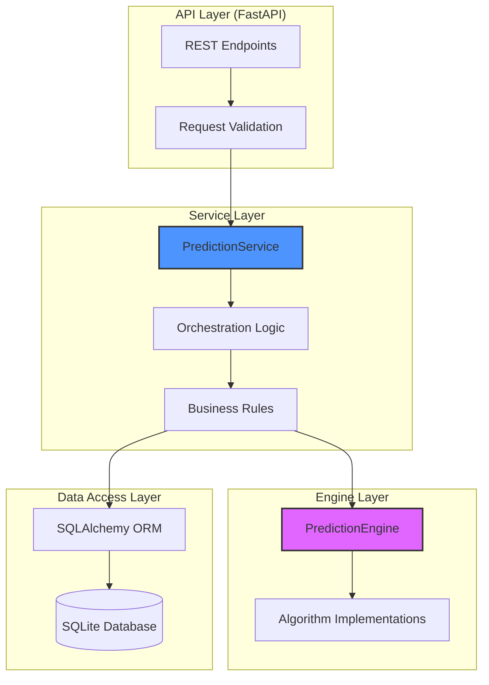
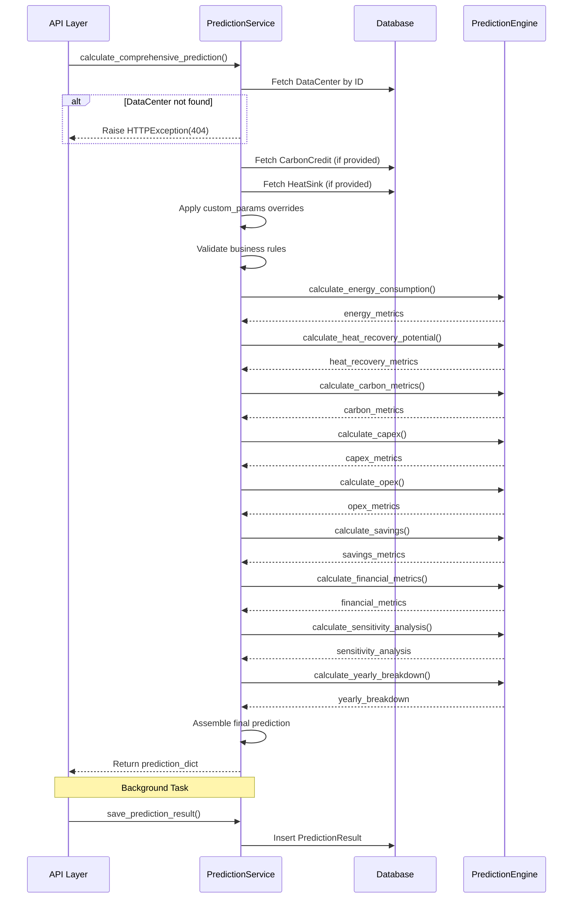

# Service Layer Documentation

## Overview

The PyRecycle Heat system follows a **layered architecture** pattern with clear separation between:

1. **API Layer** - HTTP endpoints and request/response handling
2. **Service Layer** - Business logic orchestration and validation
3. **Engine Layer** - Core computational algorithms and calculations
4. **Data Layer** - Database access and ORM operations

**Pattern:** Service Facade + Domain Logic  
**Language:** Python → **Target:** Go with dependency injection

---

## Architecture Diagram



---

## Service Layer Components

### 1. PredictionService

**Location:** `backend/prediction_service.py`  
**Purpose:** Orchestrates data center prediction calculations by coordinating database operations and engine calculations

**Key Responsibilities:**

1. **Data Retrieval** - Fetch entities from database
2. **Validation** - Ensure data integrity and business rules
3. **Engine Coordination** - Call PredictionEngine with correct parameters
4. **Result Persistence** - Save prediction results to database
5. **Error Handling** - Catch and transform errors for API layer

**Class Definition:**

```python
class PredictionService:
    """
    Service layer for prediction calculations.
    Orchestrates database operations and prediction engine calls.
    """
    
    def __init__(self):
        """Initialize prediction service with default parameters."""
        self.engine = DataCenterPredictionEngine()
        self.logger = logging.getLogger(__name__)
```

**Source:** `prediction_service.py:11-18`

---

### 2. PredictionEngine (Domain Logic)

**Location:** `backend/prediction_engine.py`  
**Purpose:** Implements pure computational logic for energy, financial, and carbon calculations

**Key Responsibilities:**

1. **Energy Calculations** - IT load, PUE, cooling, waste heat
2. **Heat Recovery** - Recoverable heat, efficiency, transmission
3. **Financial Modeling** - CAPEX, OPEX, NPV, IRR, payback
4. **Carbon Accounting** - Emissions, reductions, offsets
5. **Sensitivity Analysis** - Parameter variation impact
6. **Yearly Projections** - Time-series cash flow and metrics

**Class Definition:**

```python
class DataCenterPredictionEngine:
    """
    Calculation engine for data center heat recovery predictions.
    Implements all core algorithms and formulas.
    """
    
    def __init__(self):
        """Initialize engine with default efficiency parameters."""
        self.heat_recovery_efficiency = 0.85
        self.transmission_efficiency = 0.98
        self.carbon_intensity_grid_kg_kwh = 0.5936
        # ... (additional parameters)
```

**Source:** `prediction_engine.py:8-37`

---

## Service Method: Calculate Comprehensive Prediction

### Method Signature

```python
def calculate_comprehensive_prediction(
    self, 
    session: Session,
    data_center_id: int,
    carbon_credit_id: Optional[int] = None,
    heat_sink_id: Optional[int] = None,
    analysis_years: int = 10,
    scenario_name: str = "base_case",
    custom_params: Optional[Dict] = None
) -> Dict
```

**Source:** `prediction_service.py:20-33`

---

### Execution Flow



---

### Step-by-Step Logic

#### Step 1: Data Retrieval

```python
# Fetch data center
data_center = session.query(DataCenter).filter(
    DataCenter.id == data_center_id
).first()

if not data_center:
    logger.error(f"Data center with ID {data_center_id} not found")
    raise HTTPException(status_code=404, detail="Data center not found")
```

**Validation:**

- Data center must exist
- Raises HTTP 404 if not found

**Source:** `prediction_service.py:35-40`

---

#### Step 2: Optional Entity Retrieval

```python
# Fetch carbon credit (optional)
carbon_credit = None
if carbon_credit_id:
    carbon_credit = session.query(CarbonCredit).filter(
        CarbonCredit.id == carbon_credit_id
    ).first()
    if not carbon_credit:
        logger.warning(f"Carbon credit ID {carbon_credit_id} not found")

# Fetch heat sink (optional)
heat_sink = None
if heat_sink_id:
    heat_sink = session.query(HeatSink).filter(
        HeatSink.id == heat_sink_id
    ).first()
    if not heat_sink:
        logger.warning(f"Heat sink ID {heat_sink_id} not found")
```

**Behavior:**

- Optional entities - log warning if not found but continue
- Does not raise exception for missing optional entities

**Source:** `prediction_service.py:42-56`

---

#### Step 3: Parameter Extraction & Override

```python
# Extract data center parameters
it_load_kw = data_center.total_it_load_kw
pue = data_center.pue
utilization_percent = data_center.utilization_percent
electricity_cost_kwh = data_center.electricity_cost_kwh
operating_hours_year = data_center.operating_hours_year

# Apply custom parameter overrides
if custom_params:
    pue = custom_params.get('pue', pue)
    utilization_percent = custom_params.get('utilization_percent', utilization_percent)
    electricity_cost_kwh = custom_params.get('electricity_cost_kwh', electricity_cost_kwh)
    # ... (additional overrides)
```

**Business Rule:**

- Custom parameters override database values
- Allows scenario analysis without database mutation
- Preserves original data center configuration

**Source:** `prediction_service.py:58-75`

---

#### Step 4: Energy Consumption Calculation

```python
energy_metrics = self.engine.calculate_energy_consumption(
    it_load_kw=it_load_kw,
    pue=pue,
    utilization_percent=utilization_percent,
    electricity_cost_kwh=electricity_cost_kwh,
    operating_hours_year=operating_hours_year
)
```

**Engine Call:** `PredictionEngine.calculate_energy_consumption()`

**Returns:**

- `effective_it_load_kw`
- `total_power_kw`
- `annual_energy_kwh`
- `annual_energy_cost`
- `waste_heat_kw`

**Source:** `prediction_service.py:77-83`

---

#### Step 5: Heat Recovery Calculation

```python
distance_to_sink_km = 0.0
if heat_sink:
    # Calculate distance using geopy
    dc_coords = (data_center.location_lat, data_center.location_lng)
    hs_coords = (heat_sink.location_lat, heat_sink.location_lng)
    distance_to_sink_km = geodesic(dc_coords, hs_coords).kilometers

heat_recovery_metrics = self.engine.calculate_heat_recovery_potential(
    it_load_kw=it_load_kw,
    utilization_percent=utilization_percent,
    operating_hours_year=operating_hours_year,
    distance_to_sink_km=distance_to_sink_km
)
```

**Geospatial Logic:**

- Uses `geopy.distance.geodesic` for WGS-84 ellipsoid distance
- Distance affects heat recovery efficiency via `distance_efficiency_factor`
- If no heat sink, distance = 0 (theoretical maximum efficiency)

**Engine Call:** `PredictionEngine.calculate_heat_recovery_potential()`

**Source:** `prediction_service.py:85-100`

---

#### Step 6: Carbon Metrics Calculation

```python
renewable_percent = data_center.renewable_percent or 0.0

carbon_metrics = self.engine.calculate_carbon_metrics(
    annual_energy_kwh=energy_metrics['annual_energy_kwh'],
    renewable_percent=renewable_percent,
    heat_recovery_kwh=heat_recovery_metrics['annual_heat_recovery_kwh']
)
```

**Engine Call:** `PredictionEngine.calculate_carbon_metrics()`

**Returns:**

- `annual_co2_emissions_kg` (grid emissions)
- `annual_co2_reduction_kg` (from heat recovery)
- `carbon_intensity_kg_kwh`
- `renewable_offset_kg`
- `net_annual_co2_kg`

**Source:** `prediction_service.py:102-108`

---

#### Step 7: CAPEX Calculation

```python
capex_metrics = self.engine.calculate_capex(
    it_load_kw=it_load_kw,
    distance_to_sink_km=distance_to_sink_km,
    connection_cost_per_km=heat_sink.connection_cost_per_km if heat_sink else 100000.0
)
```

**Engine Call:** `PredictionEngine.calculate_capex()`

**Returns:**

- `heat_exchanger_cost`
- `distribution_infrastructure`
- `controls_automation`
- `contingency_reserve`
- `total_project_capex`

**Source:** `prediction_service.py:110-116`

---

#### Step 8: OPEX Calculation

```python
opex_metrics = self.engine.calculate_opex(
    total_capex=capex_metrics['total_project_capex'],
    annual_heat_recovery_kwh=heat_recovery_metrics['annual_heat_recovery_kwh']
)
```

**Engine Call:** `PredictionEngine.calculate_opex()`

**Returns:**

- `annual_maintenance_cost` (5% of CAPEX)
- `annual_monitoring_cost` (2% of CAPEX)
- `annual_utility_cost` (1% of CAPEX)
- `total_annual_opex`

**Source:** `prediction_service.py:118-123`

---

#### Step 9: Savings Calculation

```python
# Extract carbon credit price
carbon_price_per_ton = carbon_credit.price_per_ton if carbon_credit else 25.0

# Extract heat price
heat_price_per_mwh = heat_sink.heat_price_per_mwh if heat_sink else 50.0

savings_metrics = self.engine.calculate_savings(
    annual_heat_recovery_kwh=heat_recovery_metrics['annual_heat_recovery_kwh'],
    annual_co2_reduction_kg=carbon_metrics['annual_co2_reduction_kg'],
    carbon_price_per_ton=carbon_price_per_ton,
    heat_price_per_mwh=heat_price_per_mwh,
    annual_opex=opex_metrics['total_annual_opex']
)
```

**Engine Call:** `PredictionEngine.calculate_savings()`

**Returns:**

- `annual_heat_revenue`
- `annual_carbon_credit_revenue`
- `total_annual_revenue`
- `net_annual_savings` (revenue - OPEX)

**Source:** `prediction_service.py:125-139`

---

#### Step 10: Financial Metrics Calculation

```python
financial_metrics = self.engine.calculate_financial_metrics(
    total_capex=capex_metrics['total_project_capex'],
    annual_net_cash_flow=savings_metrics['net_annual_savings'],
    analysis_years=analysis_years,
    discount_rate=0.08  # 8% discount rate
)
```

**Engine Call:** `PredictionEngine.calculate_financial_metrics()`

**Returns:**

- `net_present_value` (NPV in $)
- `internal_rate_of_return` (IRR as decimal)
- `simple_payback_years`
- `discounted_payback_years`
- `benefit_cost_ratio`
- `profitability_index`
- `investment_grade` (A/B/C/D rating)

**Source:** `prediction_service.py:141-147`

---

#### Step 11: Sensitivity Analysis

```python
sensitivity_analysis = self.engine.calculate_sensitivity_analysis(
    base_npv=financial_metrics['net_present_value'],
    base_irr=financial_metrics['internal_rate_of_return'],
    total_capex=capex_metrics['total_project_capex'],
    annual_savings=savings_metrics['net_annual_savings'],
    analysis_years=analysis_years
)
```

**Engine Call:** `PredictionEngine.calculate_sensitivity_analysis()`

**Returns:**

- `npv_sensitivity` (electricity rate, heat price, discount rate variations)
- `irr_sensitivity` (CAPEX, OPEX variations)
- `breakeven_analysis` (minimum prices/costs for NPV = 0)

**Source:** `prediction_service.py:149-156`

---

#### Step 12: Yearly Breakdown

```python
yearly_breakdown = self.engine.calculate_yearly_breakdown(
    total_capex=capex_metrics['total_project_capex'],
    annual_savings=savings_metrics['net_annual_savings'],
    annual_opex=opex_metrics['total_annual_opex'],
    annual_heat_recovery_kwh=heat_recovery_metrics['annual_heat_recovery_kwh'],
    annual_co2_reduction_kg=carbon_metrics['annual_co2_reduction_kg'],
    analysis_years=analysis_years,
    discount_rate=0.08
)
```

**Engine Call:** `PredictionEngine.calculate_yearly_breakdown()`

**Returns:** Array of yearly objects:

```json
[
  {
    "year": 1,
    "cash_inflow": 1113439.04,
    "cash_outflow": 76560.0,
    "net_cash_flow": 1036879.04,
    "cumulative_cash_flow": 79879.04,
    "discounted_cash_flow": 960073.19,
    "heat_recovery_kwh": 24026616.0,
    "co2_reduction_kg": 4342330.34
  }
  // ... years 2-N
]
```

**Source:** `prediction_service.py:158-168`

---

#### Step 13: Result Assembly

```python
prediction_result = {
    "data_center_id": data_center_id,
    "carbon_credit_id": carbon_credit_id,
    "heat_sink_id": heat_sink_id,
    "scenario_name": scenario_name,
    "analysis_years": analysis_years,
    
    "energy_metrics": energy_metrics,
    "heat_recovery_metrics": heat_recovery_metrics,
    "carbon_metrics": carbon_metrics,
    "capex_metrics": capex_metrics,
    "opex_metrics": opex_metrics,
    "savings_metrics": savings_metrics,
    "financial_metrics": financial_metrics,
    "sensitivity_analysis": sensitivity_analysis,
    "yearly_breakdown": yearly_breakdown
}

return prediction_result
```

**Structure:**

- All metrics grouped by category
- Flat dictionary for JSON serialization
- Ready for API response and database storage

**Source:** `prediction_service.py:170-189`

---

## Service Method: Save Prediction Result

### Method Signature

```python
def save_prediction_result(
    self,
    session: Session,
    prediction_data: Dict
) -> PredictionResult
```

**Source:** `prediction_service.py:191-195`

---

### Execution Flow

```python
try:
    # Create PredictionResult ORM object
    prediction_result = PredictionResult(
        data_center_id=prediction_data["data_center_id"],
        carbon_credit_id=prediction_data.get("carbon_credit_id"),
        heat_sink_id=prediction_data.get("heat_sink_id"),
        scenario_name=prediction_data["scenario_name"],
        analysis_years=prediction_data["analysis_years"],
        
        # Financial summary fields
        total_capex=prediction_data["capex_metrics"]["total_project_capex"],
        annual_opex=prediction_data["opex_metrics"]["total_annual_opex"],
        annual_savings=prediction_data["savings_metrics"]["net_annual_savings"],
        
        net_present_value=prediction_data["financial_metrics"]["net_present_value"],
        internal_rate_return=prediction_data["financial_metrics"]["internal_rate_of_return"],
        payback_period_years=prediction_data["financial_metrics"]["simple_payback_years"],
        investment_grade=prediction_data["financial_metrics"]["investment_grade"],
        
        # Environmental metrics
        annual_co2_reduction_kg=prediction_data["carbon_metrics"]["annual_co2_reduction_kg"],
        annual_heat_recovery_kwh=prediction_data["heat_recovery_metrics"]["annual_heat_recovery_kwh"],
        
        # Full detailed results as JSON
        detailed_results=json.dumps(prediction_data),
        created_at=datetime.utcnow()
    )
    
    # Persist to database
    session.add(prediction_result)
    session.commit()
    session.refresh(prediction_result)
    
    logger.info(f"Saved prediction result with ID: {prediction_result.id}")
    return prediction_result
    
except Exception as e:
    session.rollback()
    logger.error(f"Error saving prediction result: {str(e)}")
    raise
```

**Transaction Management:**

- Uses session transaction
- Commits on success
- Rollbacks on failure
- Raises exception to caller

**Data Duplication Strategy:**

- Key metrics stored in dedicated columns (fast queries)
- Full detailed results in JSON text field (complete record)

**Source:** `prediction_service.py:197-227`

---

## Dependency Injection Pattern

### Current Implementation (Python)

```python
# In API endpoint
service = PredictionService()  # Direct instantiation
result = service.calculate_comprehensive_prediction(...)
```

**Issues:**

- Hard-coded dependencies
- Difficult to test
- No configuration injection

---

### Target Implementation (Go)

```go
// Service interface
type PredictionServicer interface {
    CalculateComprehensivePrediction(ctx context.Context, req *PredictionRequest) (*PredictionResponse, error)
    SavePredictionResult(ctx context.Context, data *PredictionData) (*PredictionResult, error)
}

// Service implementation
type PredictionService struct {
    db     *sql.DB
    engine PredictionEngine
    logger *slog.Logger
}

// Constructor with dependency injection
func NewPredictionService(db *sql.DB, engine PredictionEngine, logger *slog.Logger) *PredictionService {
    return &PredictionService{
        db:     db,
        engine: engine,
        logger: logger,
    }
}

// Usage in main.go
engine := NewPredictionEngine(config)
service := NewPredictionService(db, engine, logger)
handler := NewPredictionHandler(service, logger)
```

**Benefits:**

- Testable (mock dependencies)
- Configurable (inject config)
- Flexible (swap implementations)

---

## Error Handling Strategy

### Current Approach (Python)

```python
# Raise HTTP exceptions directly from service
if not data_center:
    raise HTTPException(status_code=404, detail="Data center not found")

# Generic exception handling
try:
    session.add(prediction_result)
    session.commit()
except Exception as e:
    session.rollback()
    logger.error(f"Error: {str(e)}")
    raise
```

**Issues:**

- Service layer coupled to HTTP concepts
- Generic exception handling loses context

---

### Target Approach (Go)

```go
// Custom error types
type NotFoundError struct {
    Resource string
    ID       int64
}

func (e *NotFoundError) Error() string {
    return fmt.Sprintf("%s with ID %d not found", e.Resource, e.ID)
}

// Service layer returns domain errors
func (s *PredictionService) CalculatePrediction(...) (*Prediction, error) {
    dc, err := s.db.GetDataCenter(ctx, dcID)
    if err != nil {
        if errors.Is(err, sql.ErrNoRows) {
            return nil, &NotFoundError{Resource: "DataCenter", ID: dcID}
        }
        return nil, fmt.Errorf("fetch data center: %w", err)
    }
    // ...
}

// API layer translates domain errors to HTTP
func (h *PredictionHandler) Calculate(w http.ResponseWriter, r *http.Request) {
    result, err := h.service.CalculatePrediction(...)
    if err != nil {
        var notFoundErr *NotFoundError
        if errors.As(err, &notFoundErr) {
            http.Error(w, notFoundErr.Error(), http.StatusNotFound)
            return
        }
        http.Error(w, "Internal error", http.StatusInternalServerError)
        return
    }
    // ...
}
```

**Benefits:**

- Clean separation of concerns
- Typed error handling
- Better error context
- Testable error conditions

---

## Transaction Management

### Current Approach (Python)

```python
# Session passed from API layer via dependency injection
def calculate_comprehensive_prediction(self, session: Session, ...):
    # Multiple queries in same session
    data_center = session.query(DataCenter).filter(...).first()
    carbon_credit = session.query(CarbonCredit).filter(...).first()
    # ... no explicit transaction control
    
# Separate transaction for saving
def save_prediction_result(self, session: Session, ...):
    try:
        session.add(prediction_result)
        session.commit()
    except:
        session.rollback()
        raise
```

**Issues:**

- No explicit transaction boundaries
- Read-only queries not optimized
- Inconsistent transaction handling

---

### Target Approach (Go with sqlc)

```go
// Use context for transaction propagation
func (s *PredictionService) CalculatePrediction(ctx context.Context, req *PredictionRequest) (*PredictionResponse, error) {
    // Read-only transaction for data fetching
    tx, err := s.db.BeginTx(ctx, &sql.TxOptions{ReadOnly: true})
    if err != nil {
        return nil, fmt.Errorf("begin tx: %w", err)
    }
    defer tx.Rollback() // Safe to call even after commit
    
    queries := database.New(tx)
    
    dc, err := queries.GetDataCenter(ctx, req.DataCenterID)
    if err != nil {
        return nil, fmt.Errorf("get data center: %w", err)
    }
    
    // Fetch other entities...
    
    // Commit read transaction
    if err := tx.Commit(); err != nil {
        return nil, fmt.Errorf("commit tx: %w", err)
    }
    
    // Perform calculations (no DB access)
    result := s.engine.Calculate(...)
    
    return result, nil
}

// Write transaction for saving
func (s *PredictionService) SavePredictionResult(ctx context.Context, data *PredictionData) error {
    tx, err := s.db.BeginTx(ctx, nil) // Read-write transaction
    if err != nil {
        return fmt.Errorf("begin tx: %w", err)
    }
    defer tx.Rollback()
    
    queries := database.New(tx)
    
    result, err := queries.CreatePredictionResult(ctx, database.CreatePredictionResultParams{
        DataCenterID: data.DataCenterID,
        // ... all fields
    })
    if err != nil {
        return fmt.Errorf("create prediction result: %w", err)
    }
    
    if err := tx.Commit(); err != nil {
        return fmt.Errorf("commit tx: %w", err)
    }
    
    return nil
}
```

**Benefits:**

- Explicit transaction boundaries
- Read-only optimization
- Context-based cancellation
- Type-safe queries via sqlc

---

## Logging & Observability

### Current Approach (Python)

```python
logger = logging.getLogger(__name__)

logger.info(f"Calculating prediction for data center {data_center_id}")
logger.warning(f"Carbon credit ID {carbon_credit_id} not found")
logger.error(f"Error saving prediction result: {str(e)}")
```

**Issues:**

- String formatting overhead
- No structured logging
- Limited context

---

### Target Approach (Go with slog)

```go
import "log/slog"

// Structured logging with context
logger.InfoContext(ctx, "calculating prediction",
    slog.Int64("data_center_id", dcID),
    slog.Int64("carbon_credit_id", ccID),
    slog.String("scenario", scenarioName),
)

logger.WarnContext(ctx, "carbon credit not found",
    slog.Int64("carbon_credit_id", ccID),
)

logger.ErrorContext(ctx, "failed to save prediction",
    slog.Any("error", err),
    slog.Int64("data_center_id", dcID),
)
```

**Benefits:**

- Zero allocation string formatting
- Structured data for log aggregation
- Context propagation (trace IDs)
- Performance-optimized

---

## Testing Strategy

### Current State (Python)

**Status:** No tests found in repository

**Needed Tests:**

- Unit tests for `PredictionService` methods
- Mock database sessions
- Mock engine calculations
- Test error conditions

---

### Target Testing (Go)

```go
// Service test with mocks
func TestPredictionService_Calculate(t *testing.T) {
    // Setup
    mockDB := &mockDB{}
    mockEngine := &mockEngine{}
    service := NewPredictionService(mockDB, mockEngine, slog.Default())
    
    // Test case: successful calculation
    t.Run("success", func(t *testing.T) {
        mockDB.GetDataCenterFunc = func(ctx context.Context, id int64) (*DataCenter, error) {
            return &DataCenter{ID: 1, Name: "Test DC", TotalITLoadKW: 5000}, nil
        }
        
        mockEngine.CalculateEnergyFunc = func(params EnergyParams) EnergyMetrics {
            return EnergyMetrics{EffectiveITLoadKW: 3500, TotalPowerKW: 5250}
        }
        
        result, err := service.CalculatePrediction(context.Background(), &PredictionRequest{
            DataCenterID: 1,
        })
        
        assert.NoError(t, err)
        assert.NotNil(t, result)
        assert.Equal(t, int64(1), result.DataCenterID)
    })
    
    // Test case: data center not found
    t.Run("data_center_not_found", func(t *testing.T) {
        mockDB.GetDataCenterFunc = func(ctx context.Context, id int64) (*DataCenter, error) {
            return nil, sql.ErrNoRows
        }
        
        result, err := service.CalculatePrediction(context.Background(), &PredictionRequest{
            DataCenterID: 999,
        })
        
        assert.Error(t, err)
        assert.Nil(t, result)
        
        var notFoundErr *NotFoundError
        assert.True(t, errors.As(err, &notFoundErr))
    })
}
```

**Testing Tools:**

- `testify/assert` for assertions
- `testify/mock` for mocking
- `sqlc` generates testable code
- Table-driven tests for variations

---

## Service Layer Best Practices for Go

### 1. Interface-Based Design

```go
// Define service interface
type PredictionServicer interface {
    CalculatePrediction(ctx context.Context, req *PredictionRequest) (*PredictionResponse, error)
    SavePredictionResult(ctx context.Context, data *PredictionData) (*PredictionResult, error)
}

// Implementation
type predictionService struct {
    db     Databaser
    engine EngineCalculator
    logger *slog.Logger
}

// Ensures compile-time interface compliance
var _ PredictionServicer = (*predictionService)(nil)
```

### 2. Constructor Pattern

```go
func NewPredictionService(db Databaser, engine EngineCalculator, logger *slog.Logger) PredictionServicer {
    return &predictionService{
        db:     db,
        engine: engine,
        logger: logger,
    }
}
```

### 3. Context Propagation

```go
func (s *predictionService) CalculatePrediction(ctx context.Context, req *PredictionRequest) (*PredictionResponse, error) {
    // Check context cancellation
    select {
    case <-ctx.Done():
        return nil, ctx.Err()
    default:
    }
    
    // Pass context to all downstream calls
    dc, err := s.db.GetDataCenter(ctx, req.DataCenterID)
    // ...
}
```

### 4. Error Wrapping

```go
func (s *predictionService) CalculatePrediction(ctx context.Context, req *PredictionRequest) (*PredictionResponse, error) {
    dc, err := s.db.GetDataCenter(ctx, req.DataCenterID)
    if err != nil {
        return nil, fmt.Errorf("fetch data center %d: %w", req.DataCenterID, err)
    }
    // ... provides clear error chain
}
```

### 5. Validation Layer

```go
func (s *predictionService) CalculatePrediction(ctx context.Context, req *PredictionRequest) (*PredictionResponse, error) {
    // Validate request
    if err := req.Validate(); err != nil {
        return nil, fmt.Errorf("invalid request: %w", err)
    }
    
    // Business logic validation
    if req.AnalysisYears < 1 || req.AnalysisYears > 30 {
        return nil, &ValidationError{Field: "analysis_years", Reason: "must be between 1 and 30"}
    }
    
    // ... proceed with calculation
}
```

---

## Summary

**Service Layer Responsibilities:**

| Responsibility | Current (Python) | Target (Go) |
|----------------|------------------|-------------|
| Orchestration | ✅ PredictionService | ✅ Interface-based |
| Data Access | ✅ SQLAlchemy ORM | ✅ sqlc queries |
| Validation | ⚠️ Minimal | ✅ Comprehensive |
| Error Handling | ⚠️ HTTP-coupled | ✅ Domain errors |
| Logging | ⚠️ String format | ✅ Structured (slog) |
| Testing | ❌ No tests | ✅ Mock-based unit tests |
| Transactions | ⚠️ Implicit | ✅ Explicit boundaries |

**Migration Priorities:**

1. ✅ Define service interfaces
2. ✅ Implement dependency injection
3. ✅ Add comprehensive validation
4. ✅ Create custom error types
5. ✅ Write unit tests
6. ✅ Add structured logging
7. ✅ Implement explicit transactions

---

## References

- **Python Service:** `backend/prediction_service.py`
- **Python Engine:** `backend/prediction_engine.py`
- **Go Patterns:** Effective Go, Go Wiki Best Practices
- **sqlc:** <https://sqlc.dev/>
- **slog:** <https://pkg.go.dev/log/slog>
