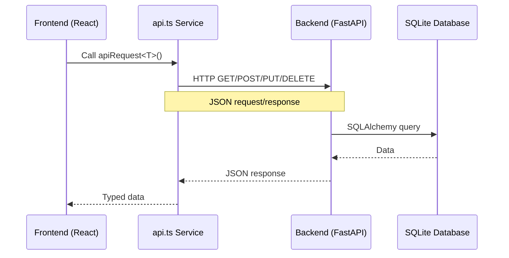
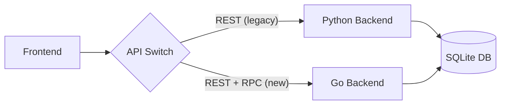
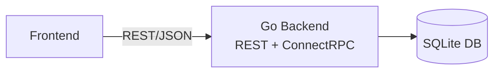

# Dependencies & Integration Points Documentation

## Overview

This document catalogs all external dependencies, libraries, frameworks, and integration points in the PyRecycle Heat system, along with their Go equivalents for the migration.

---

## Backend Dependencies (Python)

**Source:** `backend/requirements.txt`

### Core Framework Dependencies

| Package | Version | Purpose | Go Equivalent |
|---------|---------|---------|---------------|
| **fastapi** | 0.115.0 | Web framework, API routing | `github.com/gin-gonic/gin` + ConnectRPC |
| **uvicorn[standard]** | 0.32.0 | ASGI server | Standard `net/http` + Gin |
| **pydantic** | 2.10.0 | Data validation, serialization | Protocol Buffers + `validator/v10` |
| **python-multipart** | 0.0.12 | Form/file uploads | `mime/multipart` (stdlib) |

---

### Database Dependencies

| Package | Version | Purpose | Go Equivalent |
|---------|---------|---------|---------------|
| **sqlalchemy** | 2.0.36 | ORM, database abstraction | `github.com/sqlc-dev/sqlc` |
| **alembic** | *(not in requirements)* | Database migrations | `github.com/golang-migrate/migrate/v4` |

**Database Driver:** SQLite3 (embedded, no explicit package)

**Go Driver:** `github.com/mattn/go-sqlite3`

---

### Geospatial Dependencies

| Package | Version | Purpose | Go Equivalent |
|---------|---------|---------|---------------|
| **geopy** | *(inferred, not in requirements.txt)* | Geodesic distance calculation | `github.com/golang/geo` or `github.com/umahmood/haversine` |

**Usage:**

```python
from geopy.distance import geodesic
distance_km = geodesic(coord1, coord2).kilometers
```

**Go Implementation:**

```go
import "github.com/umahmood/haversine"

dist, _ := haversine.Distance(
    haversine.Coord{Lat: lat1, Lon: lon1},
    haversine.Coord{Lat: lat2, Lon: lon2},
)
// dist in kilometers
```

---

### Missing/Inferred Dependencies

These packages are used in code but not listed in `requirements.txt`:

| Package | Purpose | Source Evidence |
|---------|---------|-----------------|
| **geopy** | Geospatial calculations | `prediction_service.py:114` |
| **json** | JSON serialization | `prediction_service.py:217` (stdlib) |
| **logging** | Logging | Multiple files (stdlib) |
| **datetime** | Date/time handling | Multiple files (stdlib) |
| **typing** | Type annotations | Multiple files (stdlib) |
| **os** | Environment variables | `database.py:8` (stdlib) |

**Action Required:** Update `requirements.txt` to include all dependencies

---

## Frontend Dependencies (TypeScript/React)

**Source:** `frontend/package.json`

### Core Framework Dependencies

| Package | Version | Purpose | Status in Go Backend |
|---------|---------|---------|----------------------|
| **react** | ^18.3.1 | UI framework | N/A (frontend only) |
| **react-dom** | ^18.3.1 | React DOM renderer | N/A |
| **react-router-dom** | ^6.30.1 | Client-side routing | N/A |
| **vite** | ^6.1.7 | Build tool | N/A |
| **typescript** | ~5.7.2 | Type system | N/A |

---

### UI Component Libraries

| Package | Version | Purpose |
|---------|---------|---------|
| **@radix-ui/*** | Various | Headless UI components (accordion, dialog, dropdown, etc.) |
| **lucide-react** | ^0.462.0 | Icon library |
| **tailwindcss** | ^4.1.0 | Utility-first CSS framework |
| **class-variance-authority** | ^0.7.1 | CSS variant management |
| **tailwind-merge** | ^2.6.0 | Tailwind class merging |
| **tailwindcss-animate** | ^1.0.7 | Animation utilities |

---

### State Management & Data Fetching

| Package | Version | Purpose | Integration Point |
|---------|---------|---------|-------------------|
| **@tanstack/react-query** | ^5.83.0 | Data fetching, caching, state | Calls backend API (`api.ts`) |

**Key Integration:**

```typescript
// frontend/src/services/api.ts
const API_BASE_URL = import.meta.env.VITE_API_BASE_URL || 'http://localhost:8000';

async function apiRequest<T>(endpoint: string, options?: RequestInit): Promise<T> {
  const response = await fetch(`${API_BASE_URL}${endpoint}`, { ... });
  return await response.json();
}
```

**Go Backend Impact:**

- Must expose same REST API structure during transition
- ConnectRPC endpoints should be available via HTTP/JSON for compatibility
- CORS must allow frontend origins

---

### Form Management

| Package | Version | Purpose |
|---------|---------|---------|
| **react-hook-form** | ^7.61.1 | Form state management |
| **@hookform/resolvers** | ^3.10.0 | Form validation integration |
| **zod** | ^3.25.76 | Schema validation |

**Example Usage:**

```typescript
const formSchema = z.object({
  data_center_id: z.number(),
  analysis_years: z.number().min(1).max(30),
  // ... matches Pydantic models
});
```

**Protobuf Validation (Go):**

```protobuf
message PredictionRequest {
  int64 data_center_id = 1 [(validate.rules).int64.gt = 0];
  int32 analysis_years = 2 [(validate.rules).int32 = {gte: 1, lte: 30}];
}
```

Use: `github.com/bufbuild/protovalidate-go`

---

### Map & Geospatial Libraries

| Package | Version | Purpose |
|---------|---------|---------|
| **maplibre-gl** | ^5.7.3 | Interactive map rendering |
| **@googlemaps/js-api-loader** | ^2.0.1 | Google Maps API loader |
| **leaflet** | ^1.9.4 | Alternative map library |
| **@types/leaflet** | ^1.9.20 | TypeScript types for Leaflet |

**Current Usage:**

- Primary: MapLibre GL JS for 3D visualization
- Secondary: Google Maps (placeholder.svg suggests unused)
- Tertiary: Leaflet (potentially unused)

**Backend Geospatial Needs:**

- None (all map rendering is client-side)
- Backend only provides lat/lng coordinates
- Distance calculations happen server-side (Haversine)

---

### Chart & Visualization Libraries

| Package | Version | Purpose |
|---------|---------|---------|
| **recharts** | ^2.15.4 | React charting library |

**Usage:** `SavingsPredictionResults.tsx` - displays financial metrics, yearly breakdown

**Backend Impact:** None (client-side rendering only)

---

### Utility Libraries

| Package | Version | Purpose |
|---------|---------|---------|
| **date-fns** | ^3.6.0 | Date manipulation |
| **clsx** | ^2.1.1 | Conditional class names |
| **cmdk** | ^1.1.1 | Command menu |
| **vaul** | ^0.9.9 | Drawer component |
| **sonner** | ^1.7.4 | Toast notifications |
| **embla-carousel-react** | ^8.6.0 | Carousel component |
| **input-otp** | ^1.4.2 | OTP input component |
| **react-day-picker** | ^8.10.1 | Date picker |
| **react-resizable-panels** | ^2.1.9 | Resizable panels |

---

## Integration Points

### 1. Frontend → Backend API

**Current Flow:**



**Key Integration File:** `frontend/src/services/api.ts`

**API Functions:**

```typescript
// Heat Centers
export const getHeatCenters = () => apiRequest<HeatCenter[]>('/api/v1/heat-centers');
export const createHeatCenter = (data: Omit<HeatCenter, 'id' | 'created_at'>) => 
  apiRequest<HeatCenter>('/api/v1/heat-centers', { method: 'POST', body: JSON.stringify(data) });

// Demand Sites
export const getDemandSites = () => apiRequest<DemandSite[]>('/api/v1/demand-sites');

// Routes
export const getRoutes = () => apiRequest<Route[]>('/api/v1/routes');

// Analytics
export const getAnalyticsSummary = () => apiRequest<AnalyticsSummary>('/api/v1/analytics/summary');

// Data Centers
export const getDataCenters = () => apiRequest<DataCenter[]>('/api/v1/prediction/data-centers');

// Predictions
export const calculatePrediction = (data: PredictionRequest) => 
  apiRequest<PredictionResponse>('/api/v1/prediction/calculate', { 
    method: 'POST', 
    body: JSON.stringify(data) 
  });
```

**Source:** `api.ts:50-250` (representative sample)

---

### 2. Frontend TypeScript Types → Backend Pydantic Models

**Mapping Strategy:**

| Backend (Pydantic) | Frontend (TypeScript) | Protobuf (Target) |
|--------------------|----------------------|-------------------|
| `HeatCenter` (model) | `HeatCenter` (interface) | `message HeatCenter` |
| `DataCenter` (model) | `DataCenter` (interface) | `message DataCenter` |
| `PredictionRequest` (model) | `PredictionRequest` (interface) | `message PredictionRequest` |

**Example Alignment:**

**Python:**

```python
class HeatCenterBase(BaseModel):
    name: str
    location_lat: float
    location_lng: float
    max_capacity_mw: float
```

**TypeScript:**

```typescript
export interface HeatCenter {
  id: number;
  name: string;
  location_lat: number;
  location_lng: number;
  max_capacity_mw: number;
  // ...
}
```

**Protobuf (Target):**

```protobuf
message HeatCenter {
  int64 id = 1;
  string name = 2;
  double location_lat = 3;
  double location_lng = 4;
  double max_capacity_mw = 5;
}
```

---

### 3. Environment Configuration

**Backend Environment Variables:**

| Variable | Default | Purpose | Source |
|----------|---------|---------|--------|
| `DATABASE_URL` | `sqlite:///./district_heating.db` | Database connection | `database.py:8` |

**Frontend Environment Variables:**

| Variable | Default | Purpose | Source |
|----------|---------|---------|--------|
| `VITE_API_BASE_URL` | `http://localhost:8000` | Backend API URL | `api.ts:7` |

**Vercel Deployment Variables:**

```json
{
  "env": {
    "VITE_API_BASE_URL": "@vite_api_base_url"
  }
}
```

**Source:** `vercel.json:12-14`

---

### 4. CORS Configuration

**Backend CORS Setup:**

```python
ALLOWED_ORIGINS = [
    "http://localhost:8080",
    "http://localhost:3000",
    "http://localhost:5173",
    "https://pyrecycleheat.vercel.app"
]

app.add_middleware(
    CORSMiddleware,
    allow_origins=ALLOWED_ORIGINS,
    allow_credentials=True,
    allow_methods=["GET", "POST", "PUT", "DELETE", "OPTIONS"],
    allow_headers=["*"],
)
```

**Source:** `app.py:15-45`

**Go CORS Configuration (Target):**

```go
import "github.com/gin-contrib/cors"

config := cors.Config{
    AllowOrigins:     []string{"http://localhost:5173", "https://pyrecycleheat.vercel.app"},
    AllowMethods:     []string{"GET", "POST", "PUT", "DELETE", "OPTIONS"},
    AllowHeaders:     []string{"Origin", "Content-Type", "Accept", "Authorization"},
    AllowCredentials: true,
}

router.Use(cors.New(config))
```

---

## Go Backend Dependencies (Target)

### Core Framework & Server

| Package | Purpose |
|---------|---------|
| **github.com/gin-gonic/gin** | Web framework for REST compatibility layer |
| **connectrpc.com/connect** | RPC framework |
| **google.golang.org/protobuf** | Protocol Buffers |
| **github.com/bufbuild/buf** | Protobuf build tool |

### Database

| Package | Purpose |
|---------|---------|
| **github.com/mattn/go-sqlite3** | SQLite3 driver |
| **github.com/sqlc-dev/sqlc** | Type-safe SQL query generator |
| **github.com/golang-migrate/migrate/v4** | Database migrations |

### Validation & Utilities

| Package | Purpose |
|---------|---------|
| **github.com/go-playground/validator/v10** | Struct validation |
| **github.com/bufbuild/protovalidate-go** | Protobuf validation |
| **github.com/spf13/viper** | Configuration management |
| **github.com/google/uuid** | UUID generation |

### Geospatial

| Package | Purpose |
|---------|---------|
| **github.com/umahmood/haversine** | Haversine distance calculation |

### Logging & Observability

| Package | Purpose |
|---------|---------|
| **log/slog** | Structured logging (stdlib) |
| **github.com/prometheus/client_golang** | Prometheus metrics (optional) |
| **go.opentelemetry.io/otel** | OpenTelemetry tracing (optional) |

### Testing

| Package | Purpose |
|---------|---------|
| **github.com/stretchr/testify** | Testing assertions & mocks |
| **github.com/DATA-DOG/go-sqlmock** | SQL mock for testing |

### CORS & Middleware

| Package | Purpose |
|---------|---------|
| **github.com/gin-contrib/cors** | CORS middleware for Gin |
| **connectrpc.com/cors** | CORS for ConnectRPC |

---

## Build & Development Tools

### Python (Current)

| Tool | Purpose |
|------|---------|
| **pip** | Package management |
| **uvicorn** | ASGI server |
| **python-dotenv** | Environment variable loading |

### Go (Target)

| Tool | Purpose |
|------|---------|
| **go** | Compiler & toolchain |
| **make** | Build automation |
| **buf** | Protobuf code generation |
| **sqlc** | SQL code generation |
| **golang-migrate** | Database migration CLI |
| **air** | Hot reload during development (optional) |

### Frontend (Unchanged)

| Tool | Purpose |
|------|---------|
| **npm/bun** | Package management |
| **vite** | Build tool & dev server |
| **tsc** | TypeScript compiler |
| **eslint** | Linting |

---

## Deployment & Infrastructure

### Current Deployment

**Frontend:**

- **Platform:** Vercel
- **Framework:** Vite
- **Config:** `vercel.json`

**Backend:**

- **Status:** Not deployed (local development only)
- **Database:** SQLite file (`district_heating.db`)

### Target Deployment Strategy

**Backend (Go):**

| Aspect | Recommendation |
|--------|---------------|
| **Container** | Docker + multi-stage build |
| **Platform** | Railway / Fly.io / Cloud Run |
| **Database** | SQLite (embedded) or PostgreSQL (production) |
| **Binary Size** | ~10-15 MB (statically linked) |

**Frontend:**

- **No Changes** - Continue using Vercel

**Docker Example:**

```dockerfile
# Build stage
FROM golang:1.23-alpine AS builder
WORKDIR /app
COPY go.mod go.sum ./
RUN go mod download
COPY . .
RUN CGO_ENABLED=1 GOOS=linux go build -ldflags="-s -w" -o /dist/server ./cmd/server

# Runtime stage
FROM alpine:latest
RUN apk --no-cache add ca-certificates
WORKDIR /root/
COPY --from=builder /dist/server .
EXPOSE 8080
CMD ["./server"]
```

---

## Migration Compatibility Matrix

| Component | Python | Go | Compatibility Strategy |
|-----------|--------|----|-----------------------|
| **API Endpoints** | FastAPI REST | ConnectRPC + Gin REST | Dual protocol support during migration |
| **Data Models** | Pydantic | Protobuf | Generate TypeScript from Protobuf |
| **Database** | SQLAlchemy | sqlc | Schema migration script |
| **Validation** | Pydantic | protovalidate | Equivalent rules in Protobuf |
| **CORS** | FastAPI middleware | Gin middleware | Same configuration |
| **Logging** | Python logging | slog | Structured logs (JSON) |
| **Testing** | (none) | testify | Write comprehensive tests |

---

## Integration Testing Strategy

### Phase 1: Dual Stack (Transition)



**Environment Variable:**

```env
VITE_API_BASE_URL=http://localhost:8000  # Python
# OR
VITE_API_BASE_URL=http://localhost:8080  # Go
```

### Phase 2: Go Only



---

## External Service Integration (None Currently)

**Current State:** No external API dependencies

**Potential Future Integrations:**

| Service | Purpose | Status |
|---------|---------|--------|
| **Google Maps API** | Map tiles, geocoding | Partially integrated (unused) |
| **Carbon Credit Registries** | Live carbon pricing | Not integrated |
| **Weather APIs** | Seasonal demand forecasting | Not integrated |
| **Energy Grid APIs** | Real-time carbon intensity | Not integrated |

---

## Security Considerations

### Authentication & Authorization

**Current State:** None implemented

**Recommended (Go):**

| Feature | Package | Implementation |
|---------|---------|----------------|
| JWT Auth | `github.com/golang-jwt/jwt/v5` | Bearer token middleware |
| API Keys | Custom middleware | For service-to-service |
| Rate Limiting | `github.com/ulule/limiter/v3` | Per-IP/per-user limits |
| HTTPS | `autocert` | Let's Encrypt integration |

### Data Protection

| Concern | Mitigation |
|---------|-----------|
| SQL Injection | sqlc prevents (parameterized queries) |
| XSS | Frontend handles (React escapes) |
| CORS | Strict origin whitelist |
| Secrets | Environment variables + secret manager |

---

## Summary

### Critical Dependencies for Go Migration

**Immediate Needs:**

1. ✅ **github.com/gin-gonic/gin** - REST API compatibility
2. ✅ **connectrpc.com/connect** - RPC framework
3. ✅ **github.com/mattn/go-sqlite3** - Database driver
4. ✅ **github.com/sqlc-dev/sqlc** - Type-safe queries
5. ✅ **github.com/umahmood/haversine** - Geospatial calculations
6. ✅ **google.golang.org/protobuf** - Protocol Buffers

**Secondary Needs:**

7. ✅ **github.com/golang-migrate/migrate/v4** - Migrations
8. ✅ **github.com/gin-contrib/cors** - CORS middleware
9. ✅ **github.com/go-playground/validator/v10** - Validation
10. ✅ **github.com/stretchr/testify** - Testing

### Integration Checkpoint

**Before Migration:**

- [ ] Update `requirements.txt` with all Python dependencies
- [ ] Document all environment variables
- [ ] Create API integration test suite
- [ ] Export database schema and seed data

**During Migration:**

- [ ] Maintain REST API compatibility
- [ ] Generate Protobuf schemas from Pydantic models
- [ ] Implement equivalent CORS configuration
- [ ] Migrate database schema to Go migrations

**After Migration:**

- [ ] Update frontend to use ConnectRPC (optional)
- [ ] Deprecate Python backend
- [ ] Update deployment documentation

---

## References

- **Python Requirements:** `backend/requirements.txt`
- **Frontend Dependencies:** `frontend/package.json`
- **API Service:** `frontend/src/services/api.ts`
- **CORS Config:** `backend/app.py:15-45`
- **Database Config:** `backend/database.py`
- **Environment Config:** `vercel.json`, `api.ts`
