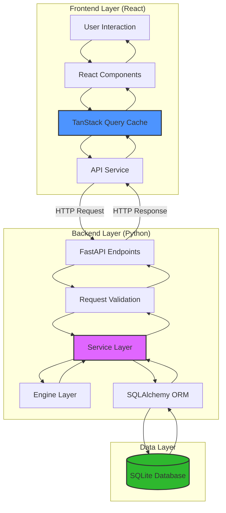
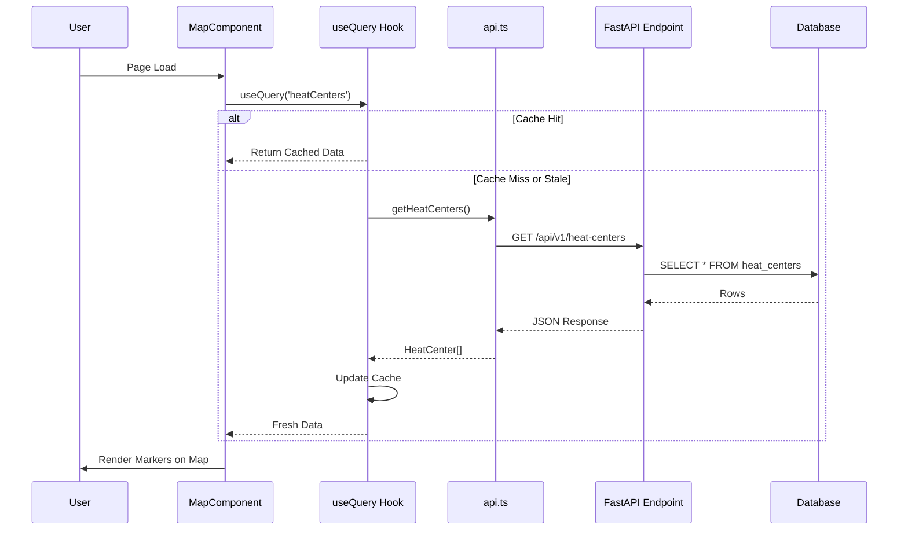
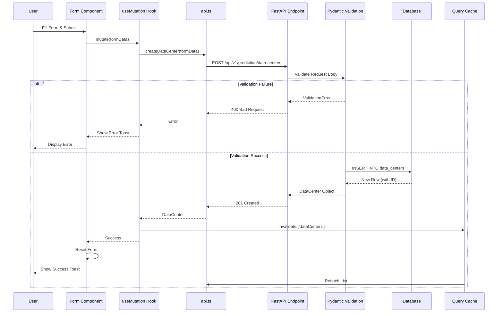
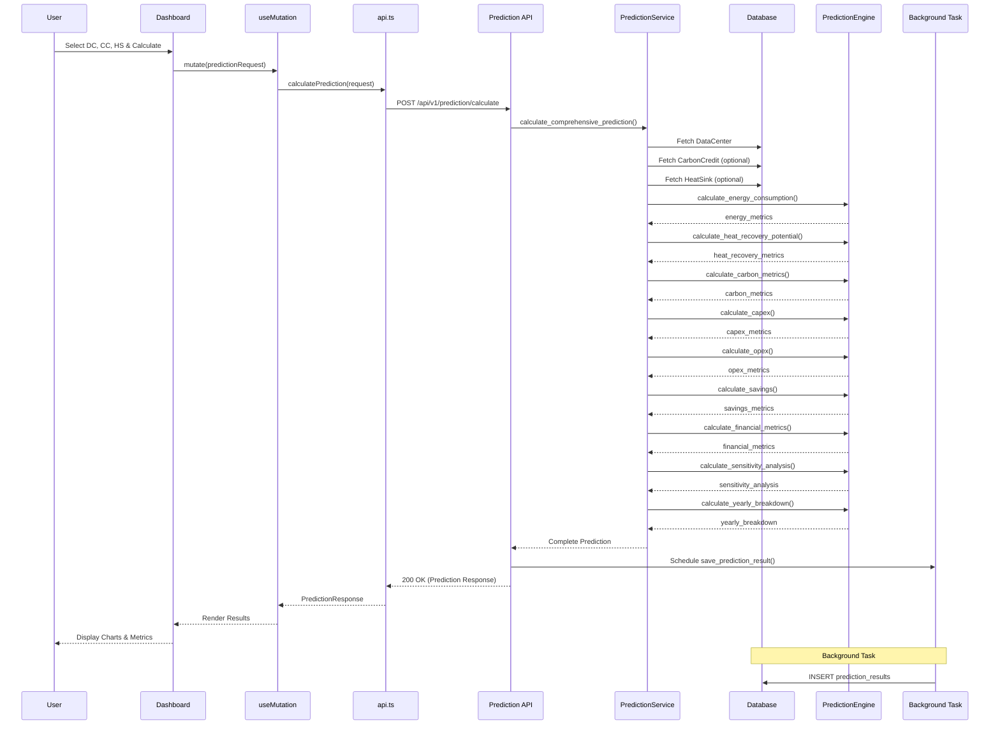
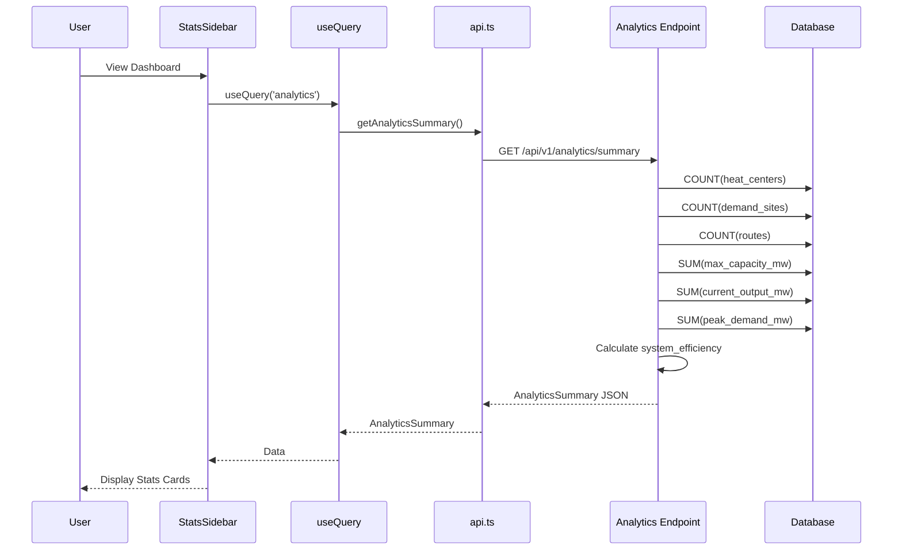
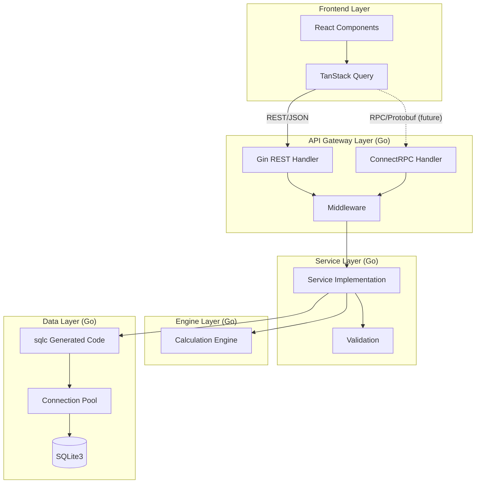

# Data Flow Patterns & State Management Documentation

## Overview

This document maps how data flows through the PyRecycle Heat system, from user interaction in the frontend through the API layer, service layer, engine layer, and database, then back to the user.

**Architecture:** Client-Server with RESTful API  
**State Management:** Frontend (TanStack Query), Backend (Stateless)  
**Data Persistence:** SQLite3 database

---

## System-Wide Data Flow



---

## Data Flow Patterns

### Pattern 1: Simple CRUD Operations (Heat Centers)

**User Action:** View all heat centers on map



**Frontend Code:**

```typescript
// Component
function MapComponent() {
  const { data: heatCenters, isLoading } = useQuery({
    queryKey: ['heatCenters'],
    queryFn: getHeatCenters,
    staleTime: 5 * 60 * 1000, // 5 minutes
  });
  
  // Render map markers...
}

// API Service
export const getHeatCenters = () => 
  apiRequest<HeatCenter[]>('/api/v1/heat-centers');
```

**Backend Code:**

```python
@app.get("/api/v1/heat-centers")
async def get_heat_centers(db: Session = Depends(get_db)):
    return db.query(HeatCenter).all()
```

**Data Flow Characteristics:**

- **Read-Only:** No mutations
- **Cacheable:** 5-minute stale time
- **Stateless Backend:** No session state
- **Automatic Serialization:** SQLAlchemy → JSON → TypeScript

---

### Pattern 2: Create Entity (POST)

**User Action:** Create new data center



**Frontend Code:**

```typescript
function DataCenterForm() {
  const queryClient = useQueryClient();
  
  const mutation = useMutation({
    mutationFn: createDataCenter,
    onSuccess: () => {
      queryClient.invalidateQueries({ queryKey: ['dataCenters'] });
      toast.success('Data center created successfully');
    },
    onError: (error) => {
      toast.error(`Failed to create: ${error.message}`);
    },
  });
  
  const handleSubmit = (data: DataCenterRequest) => {
    mutation.mutate(data);
  };
  
  // Form JSX...
}
```

**Backend Code:**

```python
@router.post("/data-centers", status_code=201)
async def create_data_center(
    data_center: DataCenterRequest,
    db: Session = Depends(get_db)
):
    # Pydantic validates automatically
    db_data_center = DataCenter(**data_center.dict())
    db.add(db_data_center)
    db.commit()
    db.refresh(db_data_center)
    return db_data_center
```

**Data Flow Characteristics:**

- **Write Operation:** Creates database record
- **Validation:** Pydantic model enforces schema
- **Cache Invalidation:** TanStack Query refetches list
- **Optimistic Updates:** Could be added for better UX
- **Transaction:** Automatic commit/rollback

---

### Pattern 3: Complex Calculation (Prediction)

**User Action:** Calculate savings prediction



**Frontend Code:**

```typescript
function SavingsPredictionDashboard() {
  const [result, setResult] = useState<PredictionResponse | null>(null);
  
  const mutation = useMutation({
    mutationFn: calculatePrediction,
    onSuccess: (data) => {
      setResult(data);
      toast.success('Prediction calculated successfully');
    },
    onError: (error) => {
      toast.error(`Calculation failed: ${error.message}`);
    },
  });
  
  const handleCalculate = () => {
    mutation.mutate({
      data_center_id: selectedDC,
      carbon_credit_id: selectedCC,
      heat_sink_ids: selectedHS,
      analysis_years: 10,
      discount_rate: 0.08,
    });
  };
  
  // Render form + results...
}
```

**Backend Code:**

```python
@router.post("/calculate", response_model=PredictionResponse)
async def calculate_savings_prediction(
    prediction_request: PredictionRequest,
    background_tasks: BackgroundTasks,
    db: Session = Depends(get_db)
):
    service = PredictionService()
    
    # Synchronous calculation
    prediction_data = service.calculate_comprehensive_prediction(
        session=db,
        data_center_id=prediction_request.data_center_id,
        carbon_credit_id=prediction_request.carbon_credit_id,
        heat_sink_id=prediction_request.heat_sink_ids[0] if prediction_request.heat_sink_ids else None,
        analysis_years=prediction_request.analysis_years,
        scenario_name=prediction_request.scenario_name,
        custom_params={
            'pue': prediction_request.custom_pue,
            # ... other overrides
        }
    )
    
    # Asynchronous save (doesn't block response)
    background_tasks.add_task(
        service.save_prediction_result,
        db,
        prediction_data
    )
    
    return prediction_data
```

**Data Flow Characteristics:**

- **Computation-Heavy:** Multiple engine calculations
- **Synchronous Response:** User waits for calculation
- **Asynchronous Persistence:** Background task saves result
- **Stateless:** All data fetched fresh per request
- **No Caching:** Results are unique per request parameters

---

### Pattern 4: Analytics Aggregation

**User Action:** View system analytics summary



**Frontend Code:**

```typescript
function StatsSidebar() {
  const { data: analytics } = useQuery({
    queryKey: ['analytics'],
    queryFn: getAnalyticsSummary,
    refetchInterval: 30000, // Refresh every 30 seconds
  });
  
  return (
    <div className="stats">
      <StatCard title="Heat Centers" value={analytics?.total_heat_centers} />
      <StatCard title="Demand Sites" value={analytics?.total_demand_sites} />
      <StatCard title="System Efficiency" value={`${analytics?.system_efficiency_percent}%`} />
      {/* ... more stats */}
    </div>
  );
}
```

**Backend Code:**

```python
@app.get("/api/v1/analytics/summary")
async def get_analytics_summary(db: Session = Depends(get_db)):
    total_heat_centers = db.query(func.count(HeatCenter.id)).scalar()
    total_demand_sites = db.query(func.count(DemandSite.id)).scalar()
    total_routes = db.query(func.count(Route.id)).scalar()
    
    active_heat_centers = db.query(func.count(HeatCenter.id)).filter(
        HeatCenter.is_active == True
    ).scalar()
    
    total_capacity = db.query(func.sum(HeatCenter.max_capacity_mw)).scalar() or 0.0
    total_output = db.query(func.sum(HeatCenter.current_output_mw)).scalar() or 0.0
    
    system_efficiency = (total_output / total_capacity * 100) if total_capacity > 0 else 0.0
    
    return {
        "total_heat_centers": total_heat_centers,
        "total_demand_sites": total_demand_sites,
        "total_routes": total_routes,
        "active_heat_centers": active_heat_centers,
        "total_capacity_mw": total_capacity,
        "total_current_output_mw": total_output,
        "system_efficiency_percent": round(system_efficiency, 2),
        # ... more metrics
    }
```

**Data Flow Characteristics:**

- **Read-Only Aggregation:** Multiple COUNT/SUM queries
- **Auto-Refresh:** Polls every 30 seconds
- **Derived Data:** Efficiency calculated from aggregates
- **Low Latency:** Simple queries with indexes
- **Cacheable:** Short stale time for real-time feel

---

## State Management Patterns

### Frontend State (TanStack Query)

**Query Cache Architecture:**

```typescript
const queryClient = new QueryClient({
  defaultOptions: {
    queries: {
      staleTime: 5 * 60 * 1000, // 5 minutes
      cacheTime: 10 * 60 * 1000, // 10 minutes
      refetchOnWindowFocus: false,
      retry: 1,
    },
  },
});
```

**Cache Keys Strategy:**

| Query Key | Data | Stale Time | Auto-Refetch |
|-----------|------|------------|--------------|
| `['heatCenters']` | List of heat centers | 5 min | On window focus |
| `['demandSites']` | List of demand sites | 5 min | On window focus |
| `['routes']` | List of routes | 5 min | On window focus |
| `['dataCenters']` | List of data centers | 5 min | On window focus |
| `['analytics']` | System summary | 30 sec | Every 30s |

**Invalidation Strategy:**

```typescript
// After creating a heat center
queryClient.invalidateQueries({ queryKey: ['heatCenters'] });

// After updating a route
queryClient.invalidateQueries({ queryKey: ['routes'] });
queryClient.invalidateQueries({ queryKey: ['analytics'] }); // Dependent data
```

**Optimistic Updates (Pattern for Implementation):**

```typescript
const mutation = useMutation({
  mutationFn: updateHeatCenter,
  onMutate: async (updatedCenter) => {
    // Cancel outgoing refetches
    await queryClient.cancelQueries({ queryKey: ['heatCenters'] });
    
    // Snapshot previous value
    const previousCenters = queryClient.getQueryData(['heatCenters']);
    
    // Optimistically update cache
    queryClient.setQueryData(['heatCenters'], (old) =>
      old.map(c => c.id === updatedCenter.id ? updatedCenter : c)
    );
    
    // Return context for rollback
    return { previousCenters };
  },
  onError: (err, updatedCenter, context) => {
    // Rollback on error
    queryClient.setQueryData(['heatCenters'], context.previousCenters);
  },
  onSettled: () => {
    // Refetch to ensure sync
    queryClient.invalidateQueries({ queryKey: ['heatCenters'] });
  },
});
```

---

### Backend State (Stateless)

**Current Pattern:** Pure stateless REST API

- **No Session State:** Each request is independent
- **No In-Memory Cache:** All data fetched from database
- **No Connection Pooling:** SQLAlchemy manages connections

**Session Management:**

```python
# Database session per request (dependency injection)
def get_db() -> Session:
    db = SessionLocal()
    try:
        yield db
    finally:
        db.close()

# Used in endpoints
@app.get("/api/v1/heat-centers")
async def get_heat_centers(db: Session = Depends(get_db)):
    return db.query(HeatCenter).all()
    # Session automatically closed after response
```

**Transaction Pattern:**

```python
# Explicit transaction (service layer)
def save_prediction_result(self, session: Session, data: Dict):
    try:
        session.add(prediction_result)
        session.commit()
        session.refresh(prediction_result)
        return prediction_result
    except Exception as e:
        session.rollback()
        raise
```

---

### Database State (Persistent)

**SQLite Persistence:**

- **Single File:** `district_heating.db`
- **ACID Transactions:** Automatic via SQLite
- **No Replication:** Single-node (development)
- **No Cache Layer:** Direct queries

**Write Patterns:**

```python
# INSERT
db.add(new_object)
db.commit()

# UPDATE
existing_object.field = new_value
db.commit()

# DELETE
db.delete(object)
db.commit()
```

**Read Patterns:**

```python
# SELECT ALL
db.query(HeatCenter).all()

# SELECT ONE
db.query(HeatCenter).filter(HeatCenter.id == id).first()

# SELECT WITH JOIN (not used currently)
db.query(Route).join(HeatCenter).filter(...).all()

# AGGREGATION
db.query(func.count(HeatCenter.id)).scalar()
db.query(func.sum(HeatCenter.max_capacity_mw)).scalar()
```

---

## Data Flow Anti-Patterns & Issues

### Issue 1: No Request Deduplication

**Problem:**

```typescript
// Component A
const { data } = useQuery({ queryKey: ['heatCenters'], queryFn: getHeatCenters });

// Component B (same time)
const { data } = useQuery({ queryKey: ['heatCenters'], queryFn: getHeatCenters });

// Result: Two simultaneous HTTP requests
```

**Solution:** TanStack Query automatically deduplicates (already handled)

---

### Issue 2: Over-Fetching Data

**Problem:** Frontend fetches entire entity when only partial data needed

**Example:**

```typescript
// Fetches all fields
const { data: heatCenters } = useQuery(['heatCenters'], getHeatCenters);

// But only needs: id, name, location_lat, location_lng for map markers
```

**Solution (Go with GraphQL or Protobuf Partial Responses):**

```protobuf
// Allow field mask
message GetHeatCentersRequest {
  google.protobuf.FieldMask field_mask = 1;
}

// Or use specific list response
message HeatCenterListItem {
  int64 id = 1;
  string name = 2;
  double location_lat = 3;
  double location_lng = 4;
}
```

---

### Issue 3: No Pagination

**Problem:** Fetches all records regardless of count

**Example:**

```python
@app.get("/api/v1/heat-centers")
async def get_heat_centers(db: Session = Depends(get_db)):
    return db.query(HeatCenter).all()  # Could be 10,000 records
```

**Solution (Go Implementation):**

```go
func (s *DistrictHeatingService) ListHeatCenters(ctx context.Context, req *v1.ListHeatCentersRequest) (*v1.ListHeatCentersResponse, error) {
    limit := req.PageSize
    if limit == 0 {
        limit = 50 // Default page size
    }
    offset := (req.Page - 1) * limit
    
    centers, err := s.db.ListHeatCenters(ctx, database.ListHeatCentersParams{
        Limit:  limit,
        Offset: offset,
    })
    
    total, err := s.db.CountHeatCenters(ctx)
    
    return &v1.ListHeatCentersResponse{
        HeatCenters: centers,
        TotalCount:  total,
        Page:        req.Page,
        PageSize:    limit,
    }, nil
}
```

---

### Issue 4: Background Task Isolation

**Problem:** Background task uses same session as request

**Current:**

```python
background_tasks.add_task(
    service.save_prediction_result,
    db,  # Same session as request
    prediction_data
)
```

**Risk:** Session may be closed before background task runs

**Solution (Go with goroutines):**

```go
// Pass data, not database connection
go func(data PredictionData) {
    ctx := context.Background() // New context
    db, err := sql.Open(...) // New connection
    defer db.Close()
    
    err = savePredictionResult(ctx, db, data)
    if err != nil {
        log.Error("failed to save prediction", "error", err)
    }
}(predictionData)
```

---

### Issue 5: No Caching Layer

**Problem:** Every request hits database, even for static reference data

**Example:** System configuration values fetched on every request

**Solution (Go with sync.Map or redis):**

```go
type ConfigCache struct {
    mu    sync.RWMutex
    cache map[string]string
    ttl   time.Duration
}

func (c *ConfigCache) Get(key string) (string, bool) {
    c.mu.RLock()
    defer c.mu.RUnlock()
    value, ok := c.cache[key]
    return value, ok
}

func (s *Service) GetConfig(ctx context.Context, key string) (string, error) {
    // Check cache first
    if value, ok := s.configCache.Get(key); ok {
        return value, nil
    }
    
    // Cache miss - fetch from DB
    value, err := s.db.GetConfig(ctx, key)
    if err != nil {
        return "", err
    }
    
    // Update cache
    s.configCache.Set(key, value)
    return value, nil
}
```

---

## Data Flow Migration to Go

### Target Architecture



**Key Improvements:**

1. ✅ **Type Safety:** Protocol Buffers end-to-end
2. ✅ **Dual Protocol:** REST (compatibility) + RPC (performance)
3. ✅ **Connection Pooling:** Efficient database access
4. ✅ **Explicit Validation:** Protovalidate rules
5. ✅ **Structured Logging:** Trace entire request lifecycle
6. ✅ **Context Propagation:** Cancellation & deadlines

---

## Summary

### Current Data Flow Characteristics

| Aspect | Current State |
|--------|---------------|
| **Frontend State** | ✅ TanStack Query (good) |
| **Backend State** | ✅ Stateless (good) |
| **Database Access** | ⚠️ Direct ORM (no caching) |
| **Validation** | ✅ Pydantic (runtime) |
| **Error Handling** | ⚠️ Basic (no context) |
| **Pagination** | ❌ None |
| **Caching** | ⚠️ Frontend only |
| **Transactions** | ⚠️ Implicit (some explicit) |
| **Concurrency** | ❌ Single-threaded Python |

### Target Data Flow Improvements (Go)

| Aspect | Target State |
|--------|--------------|
| **Type Safety** | ✅ Protobuf compile-time |
| **Database Access** | ✅ sqlc + connection pooling |
| **Validation** | ✅ Protovalidate + custom |
| **Error Handling** | ✅ Typed errors + context |
| **Pagination** | ✅ Cursor or offset-based |
| **Caching** | ✅ Multi-layer (optional) |
| **Transactions** | ✅ Explicit boundaries |
| **Concurrency** | ✅ Goroutines + channels |
| **Observability** | ✅ Structured logging + tracing |

---

## References

- **Frontend State:** `frontend/src/App.tsx` (TanStack Query setup)
- **API Service:** `frontend/src/services/api.ts`
- **Backend Endpoints:** `backend/app.py`, `backend/prediction_api.py`
- **Service Layer:** `backend/prediction_service.py`
- **Database Access:** `backend/database.py`, `backend/models.py`
