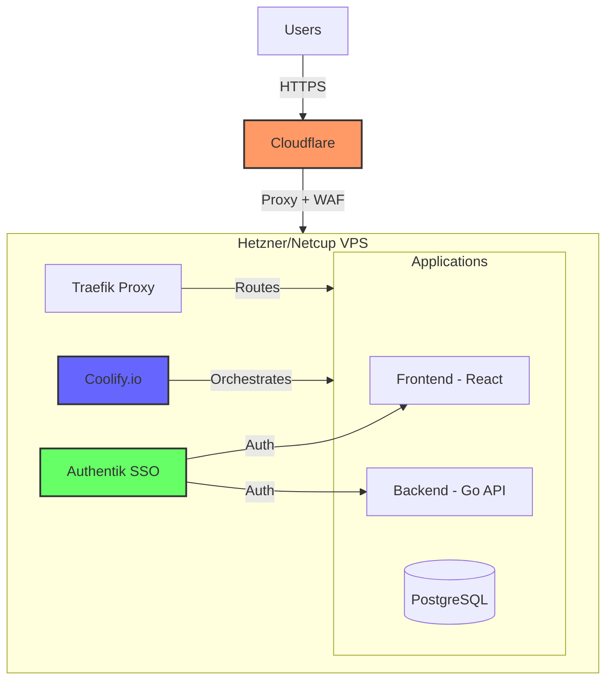
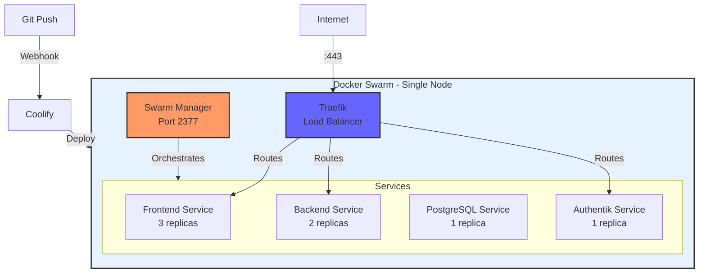

# Infrastructure Overview

So you want to self-host PyRecycle Heat. Smart choice.

You're probably tired of cloud bills that scale faster than your users, or maybe you just want full control over your infrastructure. Either way, this guide will walk you through setting up a production-ready hosting environment using affordable VPS providers, modern tooling, and Docker Swarm orchestration.

No vendor lock-in. No surprise bills. Full control.

## The Big Picture

Here's what we're building:



## Why This Stack?

Let me explain why each piece matters…

### VPS Providers (EU & US)

You need a reliable VPS that won't break the bank. Here are the best options:

#### European Options

**Hetzner** and **Netcup** are European VPS providers known for:

- Ridiculous value (€3-10/month for solid specs)
- Excellent network performance
- GDPR-compliant infrastructure
- Reliable uptime
- Data centers in Germany, Finland, and the Netherlands

**Recommended European configs:**

- **Development/Testing**: Hetzner CX21 (€5.83/mo) - 2 vCPU, 4GB RAM, 40GB SSD
- **Production**: Hetzner CX31 (€10.59/mo) - 2 vCPU, 8GB RAM, 80GB SSD
- **Budget Alternative**: Netcup VPS 1000 G10 (€5.00/mo) - 2 vCPU, 4GB RAM, 80GB SSD

#### United States Options

If you need US-based hosting for lower latency to American users:

**Linode (Akamai)**: Excellent performance, global reach

- **Development/Testing**: Linode 4GB ($24/mo) - 2 vCPU, 4GB RAM, 80GB SSD
- **Production**: Linode 8GB ($48/mo) - 4 vCPU, 8GB RAM, 160GB SSD

**Vultr**: Great value, many US locations

- **Development/Testing**: 4GB Regular ($24/mo) - 2 vCPU, 4GB RAM, 80GB SSD
- **Production**: 8GB Regular ($48/mo) - 4 vCPU, 8GB RAM, 160GB SSD

**DigitalOcean**: Developer-friendly, excellent docs

- **Development/Testing**: Basic 4GB ($24/mo) - 2 vCPU, 4GB RAM, 80GB SSD
- **Production**: Basic 8GB ($48/mo) - 4 vCPU, 8GB RAM, 160GB SSD

**Hetzner Cloud (US)**: European pricing, US data centers (Ashburn, VA)

- **Development/Testing**: CX21 ($6.50/mo) - 2 vCPU, 4GB RAM, 40GB SSD
- **Production**: CX31 ($11.50/mo) - 2 vCPU, 8GB RAM, 80GB SSD

**Best value**: Hetzner US gives you European prices with US latency.

#### Minimum Requirements

For PyRecycle Heat, you'll want at minimum:

- **4GB RAM** (2GB for apps, 1GB for PostgreSQL, 1GB for OS/overhead)
- **2 vCPUs** (one for frontend, one for backend)
- **40GB SSD** (10GB OS, 20GB database, 10GB Docker images/logs)
- **Ubuntu 22.04 LTS** (stable, well-documented)

### Coolify.io (Self-Hosted PaaS)

Think of Coolify as your own Heroku/Vercel. It's open-source, self-hosted, and handles:

- Zero-downtime deployments
- Automatic SSL certificates (via Let's Encrypt)
- Database provisioning
- Git integration
- Health checks and monitoring
- Reverse proxy management (via Traefik)

Why not raw Docker Compose? You *could*… but Coolify gives you:

- A UI for managing deployments (your future self will thank you)
- Built-in secrets management
- Automatic database backups
- Easy rollbacks
- Webhook-based CI/CD

### Authentik (Identity Provider)

Authentik is a modern, open-source SSO/identity provider. For PyRecycle Heat, it:

- Centralizes user authentication
- Provides OAuth2/OIDC flows
- Manages user permissions
- Offers MFA out of the box
- Integrates with LDAP, SAML, and social logins

This means you don't have to build user management yourself. Your Go backend can delegate auth to Authentik and just verify JWT tokens.

### Cloudflare (CDN + DNS + Security)

Cloudflare sits in front of everything, providing:

- **DNS management** (easy subdomain setup)
- **SSL/TLS termination** (automatic HTTPS)
- **DDoS protection** (free tier includes this!)
- **Web Application Firewall** (block common attacks)
- **Caching** (faster page loads for static assets)
- **Analytics** (visitor stats, threat insights)

The free tier is genuinely good enough for most projects.

## Cost Breakdown

Let's talk money… because that matters:

### Self-Hosted Stack (Our Approach)

| Service | Cost | Purpose |
|---------|------|---------|
| **Hetzner CX31 VPS (EU)** | €10.59/mo ($11.50/mo) | Hosting everything |
| **Cloudflare** | €0/mo | DNS, SSL, CDN, security |
| **Coolify** | €0/mo | Open-source PaaS |
| **Authentik** | €0/mo | Open-source SSO |
| **Domain name** | ~€10/year (~$1/mo) | Your custom domain |
| **Total (EU)** | **~€12/mo ($13/mo)** | All-in cost |

**Alternative US hosting:**

| Service | Cost | Purpose |
|---------|------|---------|
| **Hetzner CX31 VPS (US)** | $11.50/mo | Hosting everything |
| **Cloudflare** | $0/mo | DNS, SSL, CDN, security |
| **Coolify** | $0/mo | Open-source PaaS |
| **Authentik** | $0/mo | Open-source SSO |
| **Domain name** | ~$1/mo | Your custom domain |
| **Total (US - Hetzner)** | **~$13/mo** | All-in cost |

**Or with US-native providers (DigitalOcean/Linode/Vultr):**

| Service | Cost | Purpose |
|---------|------|---------|
| **DigitalOcean 4GB Droplet** | $24/mo | Hosting everything |
| **Cloudflare** | $0/mo | DNS, SSL, CDN, security |
| **Coolify** | $0/mo | Open-source PaaS |
| **Authentik** | $0/mo | Open-source SSO |
| **Domain name** | ~$1/mo | Your custom domain |
| **Total (US - DO/Linode/Vultr)** | **~$25/mo** | All-in cost |

### Compare to Managed Platforms

Here's what you'd pay for equivalent functionality:

**Vercel + Database:**

- Vercel Pro: $20/mo (needed for team features + custom domains)
- Vercel Postgres (Neon): $19/mo (8GB storage, 5GB transfer)
- Vercel Blob Storage: ~$5/mo (for file uploads)
- Auth0/Clerk (SSO): $25/mo (500 MAUs)
- **Total: $69/mo** ⚠️

**AWS Lightsail + Managed Services:**

- Lightsail 2GB instance: $10/mo
- RDS PostgreSQL (db.t3.micro): $15/mo
- CloudFront CDN: $5/mo (estimated)
- Cognito (auth): $0 (pay per user, ~$5/mo for 1000 users)
- Load Balancer: $18/mo
- **Total: $53/mo**

**DigitalOcean App Platform:**

- App Platform (Basic): $12/mo
- Managed PostgreSQL: $15/mo
- Spaces CDN: $5/mo
- **Total: $32/mo** (no built-in SSO)

**Heroku:**

- Eco Dyno (frontend): $5/mo
- Eco Dyno (backend): $5/mo
- Standard PostgreSQL: $50/mo (10GB, 120 connections)
- **Total: $60/mo**

**Render:**

- Web Service (frontend): $7/mo
- Web Service (backend): $7/mo
- PostgreSQL (Starter): $7/mo
- **Total: $21/mo** (but limited resources)

**Railway:**

- Starter Plan: $5/mo base + usage
- Typical monthly cost: $15-25/mo (small app)
- **Estimated Total: $20/mo**

### The Math

**Self-hosted (Hetzner EU): €12/mo ($13/mo)**
**vs. Vercel + managed services: $69/mo**

**You save: $56/month or $672/year** 💰

Even with US providers (DigitalOcean at $25/mo), you still save $44/mo ($528/year) compared to Vercel.

Plus, you get:

- Full control over infrastructure
- No vendor lock-in
- Unlimited traffic (no surprise bills)
- SSH access for debugging
- Custom runtime environments
- No cold starts
- Ability to run background jobs without extra cost

## What You Need Before Starting

Before we dive in, gather these:

1. **VPS Account** (choose one based on your location/budget)

   **European Options:**

   - [Hetzner Cloud](https://www.hetzner.com) (best value, EU/US data centers)
   - [Netcup](https://www.netcup.de) (budget-friendly, German DCs only)

   **US Options:**

   - [Hetzner Cloud US](https://www.hetzner.com) (best value, Ashburn VA)
   - [Linode/Akamai](https://www.linode.com) (premium, global)
   - [Vultr](https://www.vultr.com) (good value, many US locations)
   - [DigitalOcean](https://www.digitalocean.com) (developer-friendly, excellent docs)

   Add payment method and verify email after signup.

2. **Domain Name**

   - Buy from [Namecheap](https://www.namecheap.com), [Porkbun](https://porkbun.com), or [Cloudflare Registrar](https://www.cloudflare.com/products/registrar/)
   - Something like `pyrecycleheat.com`
   - Cost: ~$10-15/year

3. **Cloudflare Account**

   - Sign up at [cloudflare.com](https://cloudflare.com)
   - Free tier is fine (and generous!)
   - Provides DNS, SSL, CDN, and security

4. **SSH Key Pair**

   - Generate with: `ssh-keygen -t ed25519 -C "your-email@example.com"`
   - You'll add the public key to your VPS
   - Save the private key securely (you need it to connect)

5. **GitHub Repository**

   - Your PyRecycle Heat code needs to be in a Git repo
   - Coolify will pull from this for automatic deployments
   - Set up webhooks for CI/CD

## Architecture Decisions

Let me explain some choices we're making…

### Single Server vs. Multi-Server

We're starting with a **single-server setup** because:

- PyRecycle Heat isn't handling millions of requests/day (yet)
- Vertical scaling is easier to reason about
- You avoid complexity of distributed systems
- Cost is significantly lower

When to split into multiple servers:

- Database queries become the bottleneck → move to PostgreSQL and a dedicated server
- Frontend traffic overwhelms backend → add dedicated frontend server
- You need geographic distribution → deploy to multiple regions

### Docker Swarm for Orchestration

We're using **Docker Swarm** (not Kubernetes) for container orchestration because:

**Why Docker Swarm over Kubernetes?**

- **Simpler**: No steep learning curve, works with Docker Compose syntax
- **Lighter**: Runs on a single node without excessive overhead
- **Built-in**: Already included with Docker (no extra installation)
- **Self-healing**: Automatically restarts failed containers
- **Rolling updates**: Zero-downtime deployments
- **Service discovery**: Built-in DNS for container-to-container communication
- **Secrets management**: Encrypted storage for passwords/keys

**When to use Kubernetes instead:**

- You have 10+ servers
- You need complex scheduling policies
- You require advanced networking features
- You have a dedicated DevOps team

For PyRecycle Heat on a single VPS, Swarm is the sweet spot.

#### Swarm Architecture



**Key Features We'll Use:**

1. **Service Replicas**: Run multiple instances of frontend/backend for redundancy
2. **Health Checks**: Swarm monitors containers and restarts unhealthy ones
3. **Rolling Updates**: Update services without downtime (10% at a time)
4. **Overlay Networks**: Isolated networks for inter-service communication
5. **Secrets**: Encrypted environment variables and credentials

**Example Stack Configuration:**

```yaml
version: '3.8'

services:
  frontend:
    image: registry.pyrecycleheat.com/frontend:latest
    deploy:
      replicas: 3
      update_config:
        parallelism: 1
        delay: 10s
      restart_policy:
        condition: on-failure
    networks:
      - web

  backend:
    image: registry.pyrecycleheat.com/backend:latest
    deploy:
      replicas: 2
      update_config:
        parallelism: 1
        delay: 10s
      restart_policy:
        condition: on-failure
    secrets:
      - db_password
    networks:
      - web
      - internal

  db:
    image: postgres:15-alpine
    deploy:
      replicas: 1
      placement:
        constraints:
          - node.role == manager
    volumes:
      - db_data:/var/lib/postgresql/data
    secrets:
      - db_password
    networks:
      - internal

secrets:
  db_password:
    external: true

networks:
  web:
    driver: overlay
  internal:
    driver: overlay
    internal: true

volumes:
  db_data:
```

### Container Strategy

We're using Docker containers for:

- **Frontend**: Built from `vite build`, served via nginx
  - 3 replicas for high availability
  - Each uses <200MB RAM
  - Scales horizontally automatically

- **Backend**: Go binary in minimal Alpine image
  - 2 replicas for redundancy
  - Each uses ~500MB RAM
  - Stateless (can scale to N replicas)

- **PostgreSQL**: Official postgres:15-alpine image
  - Single replica with persistent volume
  - 2GB RAM allocated
  - Backups via Coolify + S3

- **Authentik**: Official authentik/server image
  - 1 replica sufficient for SSO
  - ~1GB RAM
  - Redis sidecar for sessions

**Why containers?**

- Consistent environments (dev = prod)
- Easy rollbacks (just redeploy previous image)
- Resource isolation (no dependency conflicts)
- Coolify native support
- Docker Swarm orchestration
- Service mesh without complexity

### Network Security

Our security layers:

1. **Cloudflare**: Hides your real IP, filters malicious traffic
2. **VPS Firewall**: Only ports 80, 443, and 22 (SSH) open
3. **Docker Networks**: Apps communicate via internal networks
4. **Authentik**: All user-facing endpoints require auth
5. **API Keys**: Backend-to-backend communication uses secrets

## Resources

- **Docker Swarm Docs**: [docs.docker.com/engine/swarm/](https://docs.docker.com/engine/swarm/)
- **Coolify Documentation**: [coolify.io/docs](https://coolify.io/docs)
- **Authentik Docs**: [goauthentik.io/docs/](https://goauthentik.io/docs/)
- **Traefik Docs**: [doc.traefik.io/traefik/](https://doc.traefik.io/traefik/)
- **Cloudflare Learning**: [developers.cloudflare.com](https://developers.cloudflare.com)

## Support & Community

- **Coolify Discord**: [discord.gg/coolify](https://discord.gg/coolify)
- **Authentik Discord**: [goauthentik.io/discord](https://goauthentik.io/discord)
- **Docker Community**: [forums.docker.com](https://forums.docker.com)

Let's build something production-ready.
